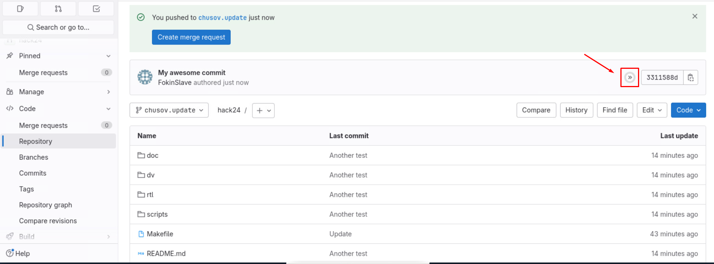
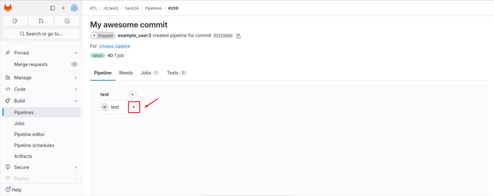
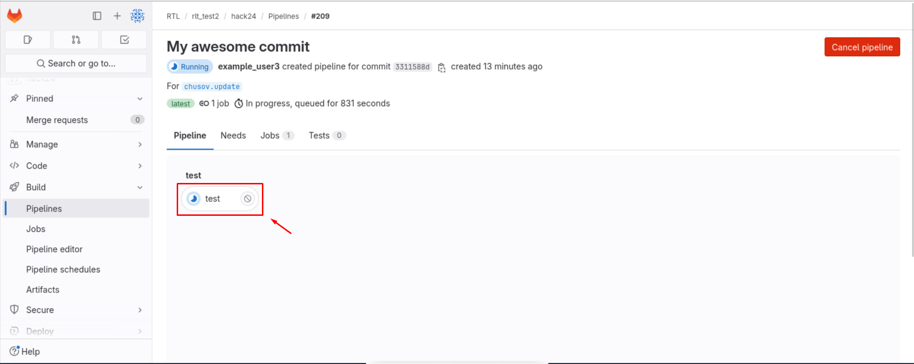
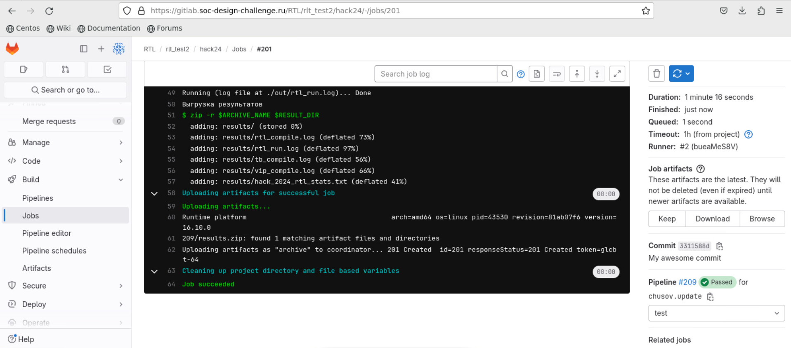
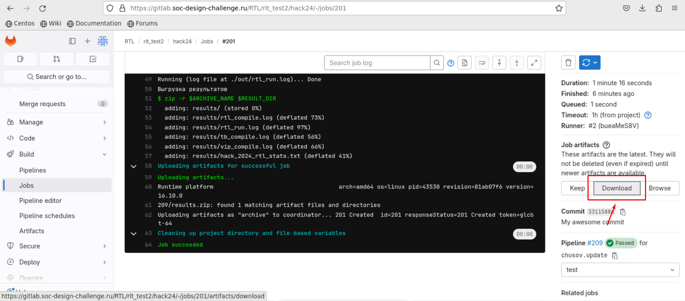

# Инструкция по запуску CI

## Общая информация

**Для финальной проверки дизайна и получения его конечных метрик производительности используется закрытое тестирование**, которое реализуется при помощи Continiuos Integration (CI).

Дальнейшее повествование предполагает, что пользователь склонировал и обновил персональный репозиторий. Как это сделать - описано в [руководстве по работе с Gitlab](git_manual.md).

## Запуск

После каждого push в персональный репозиторий у пользователя появляется возможность запустить закрытое тестирование. Важно заметить, что **push в main не может быть сделан**. 

Предположим, что был сделан push и сейчас последний коммит в репозитории называется `My awesome commit`.

На главной странице репозитория рядом с названием и хэшом коммита **появится возможность запустить CI - серая двойная стрелка**:

Далее необходимо нажать на неё. Вы будете перенаправлены на страницу запуска. Необходимо будет нажать на серый треугольник.

Статус запуска поменяется и необходимо будет нажать на его название.

Далее необходимо будет дождаться вывода в консоль `Job succeeded`. Если выводом послужило `Job failed` - обратитесь к организаторам.

## Анализ артефактов

Для выгрузки артефактов необходимо нажать `Download` в правой части экрана:

А далее распаковать скачанный архив.

Артефактами запуска являются лог-файлы, описанные в [инструкции по запуску верификационного окружения](./dv.md).

Вас будут интересовать:

- `dv/build/out/rtl_compile.log` - лог компиляции дизайна;
- `dv/build/out/tests/<название-теста>/rtl_run.log` - лог запуска тестирования.
