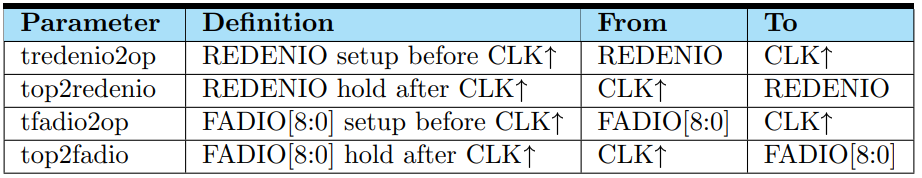

# Dual Port SRAM Specification

## Specification

### 1 Block Diagram

**Figure 1**: Block diagram of Dual Port SRAM  

**Note**: Test pins: `RTSEL[1:0]`, `WTSEL[1:0]`

**Figure 2**: Internal Function Block Diagram of Dual Port SRAM  

### 2 Function  

The Dual Port SRAM is synchronized and triggered by a clock rising edges, CLKA/CLKB. Input address AA/AB, input data DA/DB, chip enable CEBA/CEBB, and write enable WEBA/WEBB are latched by the rising edge of the clock. The following sections explain major operation of the Dual Port SRAM.  

#### Read Operation  
The chip enable, CEBA/CEBB must be low and WEBA/WEBB stays high at CLKA/CLKB rising edge. Data is read and then transmitted to output bus QA/QB[N-1:0] from memory location specified by AA/AB[M-1:0].  

#### Write Operation  
The chip-enable, CEBA/CEBB and write-enable, WEBA/WEBB must be low at CLKA/CLKB rising edge. Data DA/DB[N-1:0] is written into memory location specified by address AA/AB[M-1:0]. The bit-write feature is controlled by BWEBA/BWEBB[N-1:0].   

#### Address Contention in General  
Since CLKA and CLKB can be independent clocks whose edges may not be synchronized to each other, address contentions between ports A and B can not always be resolved. Address contention occurs in this design when the same address is latched with both rising edges of CLKA and CLKB during the following operations: write port A and write port B, write port A and read port B, or read port A and write port B. Simultaneous reading of the same address from ports A and B is allowed because this type of contention operation can always be resolved. If an address contention occurs during write operations on both ports, indeterminate results can be written to the memory array. If an address contention occurs during a write to one port and a read from the other port, indeterminate results can be read from the array. The timing specification, toc relates the minimum time required between CLKA and CLKB in order for same address operations to successfully occur.  

#### Address Contention with Read Operation Followed by Read Operation
Simultaneous reading of the same address from ports A and B is allowed because this type of contention operation can always be resolved.  

#### Address Contention with Write Operation Followed by Read Operation
If an address contention occurs during a write to one port and a read from the other port, the write will be successful but the read result will be indeterminate. The specification toc (measured from both clocks rising) is the minimum separation time required for a write to one port to complete before a successful read from the same address (from the other port) can occur. This guarantees that the data is written to the array before the data is accessed for a read operation from the other port. If specification toc is violated during a write followed by a read operation, the read output is indeterminate and the memory content at that address is valid. The write port output data remains unchanged.  

#### Address Contention with Read Operation Followed by Write Operation
If an address contention occurs during a read from one port followed by a write to the other port, indeterminate results will be read from array but write to the array will be still successful. The specification toc (measured from both clocks rising) is also the minimum separation time required for a read from one port successfully complete before a write to the same address (from the other port) can occur. This guarantees that the data read from the array before the data is accessed for a write operation to the other port. If specification toc is violated during a read followed by a write operation, the read output is indeterminate and the memory content at that address is valid. The write port output data remains unchanged.  

#### Address Contention with Write Operation Followed by Write Operation
If an address contention occurs during write operations on both ports, indeterminate results can be written to the memory array. The output of both ports remain unchanged.  

#### Sleep Mode
The chip-enable, CEBA/CEBB and sleep mode, SLP must be high to enter the mode. It reduces standby leakage power by switching off part of the periphery circuitry. There is up to $30\%$ current reduction depending on macro size. The data in the memory is retained during this mode.  

#### Deep Sleep Mode
The deep sleep mode pin, DSLP must be high to enter the mode after CEB high being latched at CLK rising edge. It reduces standby leakage by switching off the power supply to part of periphery circuit while the bit cell power is sustained at lower VDD. Thus the memory content is retained during the deep sleep mode.  

#### Shut Down Mode
The chip-enable, CEBA/CEBB and sleep mode, SD must be high to enter the mode. It reduces standby leakage power by switching off most of the periphery circuitry and SRAM bitcells. There is up to $90\%$ reduction depending on macro size. The data is not retained in the memory during this mode.  

#### Dual Rail
Level shifters are built-in at the macro input interface to convert the input pin voltage level from VDD to VDDM, the power voltage supplies inner memory periphery and bitcell array. This feature allows SOC to operate at a different voltage level from SRAM macro.  

#### Redundancy
Column redundancy is built-in for repairing defect bit cells. To start the repair function, the defective IO number must be addressed by parallel in redundancy input pins. Once repair function is activated, the defective IO of columns will be replaced by the redundant IO.  

### 3 Compiler Range Information

Dual Port SRAM memory macro can be configured by column mux option (CM), number of words (W), and number of bits per word (N). The valid range of these parameters is specified in the Table 1.

| Mux | Word Depth | Word Width (I/O) |
| --- | --- | --- |
| CM | W | N |
| 4 | 64, 128 … 2048 | 4, 5, 6 … 72 |

**Table 1**: Configuration Range

### 4 Pin Description

Refer to Table 2 for detail pin description.  

**Table 2**: Pin Description  

Refer to Table 3. Compiler timing characterization and silicon verification are based on test pin default setting. Only the test pin default setting is allowed for silicon characterization. The other settings are not allowed and tsme does not characterize timing for other settings. The other setting combinations of logic state is used for debugging purpose only.  

| RTSEL[1:0] | WTSEL[1:0] |
| --- | --- |
| 01 | 01 |

**Table 3**: Test Pin default settings  

### 5 Logic Truth Table

**Table 4**:  Active Pins in Normal Function Mode  

Note: [i] represents specific bit(IO)  
 

**Table 5**:  Dual Port Contention Table  

- Note1 : A port read & B port read with the same address is always safe regardless of clock separation(tcc).
- Note2 : A port write & B port read with the same address where tcc is violated would still write into the memory at that address but the read output is indeterminate. If bweba[i] is high for A port write & B port read, then mem[a][i] is unchanged.  
- Note3 : A port read & B port write with the same address where tcc is violated would still write into the memory at that address but the read output is indeterminate. If bwebb[i] is high for A port read & B port write, then mem[b][i] is unchanged.  
- Note4 : A port write & B port write with the same address where tcc is violated would invalidate the memory contents at that address. If bweba[i] and bwebb[i] are high for A port write & B port write, then mem[a][i](same location as mem[b][i]) is unchanged.  

**Table 6**:  Active Pins in Sleep and Shut down Functional Modes  

**Table 7**:  Active Pins in BIST mode

### 6 Hazard Conditions

Below table lists the pin combinations that do not exist in normal function and may cause unknown memory content or data output. Users should be aware of or avoid these combinations.

**Table 8**: SRAM hazard conditions  

**Table 9**: SRAM hazard conditions: Redundancy repair setting  

#### Terms used in the above truth or hazard tables
**Condition:**  
- **L**: logic low  
- **H**: logic high  
- **X**: unpredictable data, it can be either "0" or "1" but not deterministic  
- **Z**: high impedance  
- **-**: L, H, X, not include Z  
- **valid**: stable (could be 0 or could be 1) in fixed condition  
- **$\uparrow$**: signal rising edge  

**Output Q:**  
- **hold**: keep previous state  
- **X**: unpredictable data, it can be either "0" or "1" but not deterministic  
- **L**: logic low  
- **data-out**: output of normal read function  

**Mem:**  
- **mem[a] = X**: memory content is unpredictable at the specific memory address A  
- **mem[a][i] = X**: memory content is unpredictable at the specific memory address A and specific IO  
- **hold**: keep the previous state  
- **all X**: all memory contents are unpredictable  

### 7 Timing Parameter

- The maximum slew for each input signal is 0.580 ns  
- All timing is measured from a logic threshold at 50% of the power supply  
- Slew rates are measured from 10% to 90% of the power supply  

**Table 10**: Timing Specification Symbols and Definitions   

**Table 11**: Timing Specification for Sleep Mode  

**Table 12**: Timing Specification for Deep Sleep Mode  

**Table 13**: Timing Specification for Shut Down Mode  

**Table 14**: Timing Specification for PUDELAY Mode  

**Table 15**:  Timing Specification for Redundancy Mode  

### 8 Timing Waveform

**Figure 3**: Timing protocol of SRAM Read-only operation  

**Figure 4**: Timing protocol of SRAM Write-only operation  

**Figure 5**: Clock Separation with Addresses Contention  

**Figure 6**: Timing protocol of BIST  

**Figure 7**: Timing protocol of the sleep mode (with disable assertion latched by clock)  

#### Sleep Mode behavior:
- SLP pin is an asynchronous control input pin.  
- SLP pin must be active high for entering sleep mode (1'b1 = power saving).  
- All input pins except SD and SLP can be floating or unknown (X) during sleep mode (SLP=1'b1).  
- The chip enable signal must be disabled with asserting high prior entering sleep mode.  
- SRAM wake up time from sleep mode to normal stand-by mode (tslpwk) is required and must be sufficiently aranteed for instance to have healthy power supply.  
- The SRAM data output (Q) is logic low after SLP is activated (SLP = 1'b1) with certain waiting time, tslpq. While SLP is still activated, data output (Q) remains logic low.  

**Figure 8**: Timing protocol of the deep sleep mode (with disable assertion latched by clock)  

#### Deep Sleep Mode behavior:
- DSLP pin is an asynchronous control input pin.  
- DSLP pin must be active high for entering deep sleep mode (1'b1 = power saving).  
- Prior to entering deep sleep mode, the memory macro must be disabled with CEB asserting high.  
- Most of input pins can be floating or unknown (x) during deep sleep mode (DSLP=1'b1) except SD and redundancy related pins.  
- After DSLP goes high (1'b1), tdslpx timing shall be met before input pins become floating or unknown (x) states. Similarly, txdslp timing shall be met before DSLP goes low (1'b0) to ensure input pins are valid (0/1).  
- The SRAM data output (Q) is logic low after DSLP is activated (DSLP=1'b1) with certain waiting time, tdslpq. While DSLP is still activated, data output (Q) remains logic low.  
- SRAM wake up time from deep sleep mode to normal mode (tdslpwk) is required and must be sufficiently guaranteed for instance to have healthy power supply.  
- The required timing "tdslp" guarantees the last CLK cycle read or write successfully when last CLK cycle latches CEB="L". Once "tdslp" is satisfied, CLK can be either L or H or toggled before DSLP actives high.  

**Figure 9**: Timing protocol of the shut down mode

#### Shut Down Mode behavior:
- SD pin is an asynchronous control input pin.  
- SD pin must be active high (1'b1 = power saving).  
- All input pins except SD can be floating or unknown (X) during shut down mode (SD=1'b1).  
- The SRAM data output (Q) is logic low after SD is activated (SD=1'b1) with certain waiting time, tsdq. While SD is still activated, data output (Q) remains logic low.  
- When the values of data output (Q) changes from logic low (shut down mode) to unknown-X (normal stand-by mode), there is no high-Z on output Q.  

**Figure 10**: Timing protocol of macro wake up/shut down vs PUDELAY  

#### PUDELAY behavior:
- The PUDELAY is logic high after SD goes high with certain waiting time, tsd2pudly
- The PUDELAY is logic low after SD is disabled with certain waiting time, tsdwk2pudly