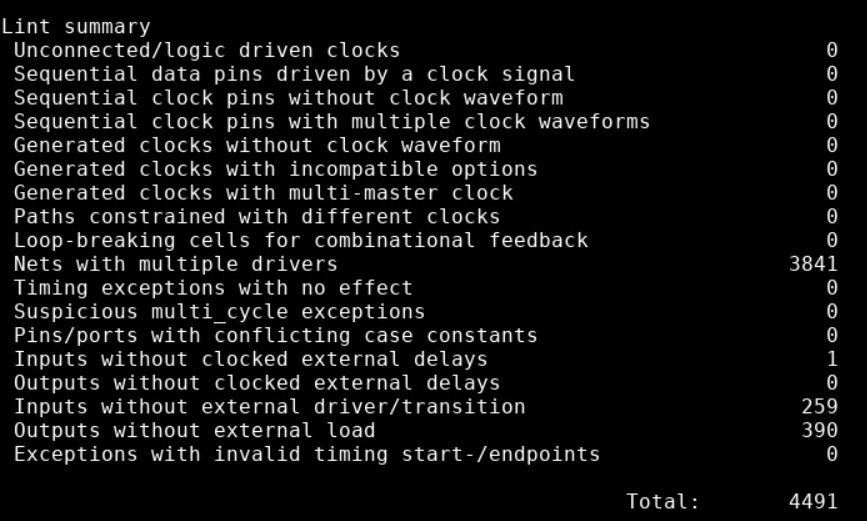

[[_genus]]
= Инструкция по проведению логического синтеза в genus
:toc:
:toc-title: Оглавление
:toclevels: 3 

== Введение

Логический синтез -- процесс преобразования высокоуровневого описания цифровой схемы (RTL) в низкоуровневое (netlist).

Для логического синтеза требуются следующие артефакты:

. RTL
. SDC -- временнЫе и физические ограничения дизайна;
. .lib -- модели ранее синтезированных блоков (ячейки, памяти, другие hardmacro);
. UPF -- описание архитектуры питания;
. floorplan.

NOTE: UPF, floorplan - опциональные артефакты, в текущем сетапе не используются.

Этапы логического синтеза:

. elaboration (elab_init) -- преобразование RTL-кода в промежуточное представление, понятное инструменту синтеза;
. syn generic (syn_gen) -- переход от RTL-конструкций (if, case, арифметических операций) к базовым *технологически независимым* логическим ячейкам (AND, OR, NOT и т.д.);
. syn optimization (syn_opt) - оптимизация логической схемы для улучшения характеристик (timing, area, power);
. syn mapping (syn_map) -- замена *технологически независимых* ячеек на ячейки из библиотеки стандартных ячеек (standard cell library), поставляемой фабрикой;
. final - финальная оптимизация схемы с учетом всех ограничений (timing, area, power).

По завершении логического синтеза пользователь получает:

. netlist;
. отчеты о проведении синтеза.

Инструкция описывает работу с *genus* (САПР от Cadence для логического синтеза в маршруте проектирования ASIC) и преднастроенными скриптами запуска.

== Проведение логического синтеза

=== Запуск синтеза

Скрипты запуска логического синтеза написаны с помощью утилиты *Make*. Все команды, описанные ниже надо запускать в корневой директории проекта, где находится `Makefile`.

WARNING: Правки в `Makefile` запрещены и могут привести к неправильной работе genus.

Команда для запуска логического синтеза:
[source,shell]
----
make syn_build
----

По умолчанию частота для синтеза -- `300` МГц. Для синтеза на другой частоте измените значение в `freq.mk`.

NOTE: genus не стремится максимально оптимизировать дизайн, его цель -- slack >= `0`. Поэтому если у вас есть запас в несколько _[ns]_ по самому худшему slack, попробуйте *немного* поднять частоту при следующем запуске. Синтез может идти дольше, но дизайн будет лучше оптимизирован и, возможно, slack сведется к `0` на более высокой частоте.

WARNING: Время синтеза зависит от частоты. Чем выше частота, тем больше нужно времни.

=== Остановка синтеза для дебага

Для отладки RTL можно остановить синтеза на раннем этапе - это сэкономит время. Переопредели `INIT_PAUSE` в `1` для остановки. По-умолчанию переменная равна `0` - синтез не останавливается.

[source,shell]
----
make syn_build INIT_PAUSE=1
----

Синтез будет приостановлен после зачитывания RTL, SDC, .lib и элаборации. Ты получишь доступ в командную строку. Для продолжения синтеза используй `resume`.

=== Завершение синтеза

После завершения синтеза genus сохраняет результаты в базу данных (database) и формирует отчеты (report).

Структура директорий после синтеза:
[source,text]
----
syn
├── out
|   └──reports
├── work_genus
    └── elab_init
    └── syn_gen
    └── syn_opt
    └── syn_map
    └── final
----

В директории `syn/out/reports` ты найдешь все отчеты, достаточные для анализа дизайна.

В директориях `syn/work_genus/...` хранятся базы данных, нетлисты и отчеты конкретной стадии синтеза.

TIP: Просмотр отчетов каждой стадии может быть не таким полезным, как анализ отчетов полного синтеза.

=== Открытие базы данных

TIP: Открытие базы данных не обязательный шаг разработки. Он позволяет более качественно погрузиться в оптимизацию, но имеет высокий порог вхождения. Стоит прибегать к нему, когда RTL на первый взгляд оптимизирован и нужны точечные правки.

Для просмотра схемы дизайна после синтеза или продвинутому просмотру отчетов синтеза необходимо открыть базу данных. Используй команду, чтобы открыть genus без запуска синтеза:
[source,shell]
----
make syn_genus
----

После появления доступа к командной строке genus напиши:
[source,shell]
----
read_db ./final/<design_name>_<date>_<time>.db
----
date - дата запуска, time - время запуска.

TIP: Точечные оптимизации RTL имеет смысл проводить после анализа полного синтеза. Советуем открывать final database (как в команде выше)

genus имеет встроенный мануал - *cdnshelp*. В нём хранится описание всех команд для командой строки genus, их ключей и параметров.

Используй make для открытия мануала:
[source,shell]
----
make syn_cdnshelp
----

=== Отчеты логического синтеза

В `syn/out/reports` находятся необходимые отчеты для анализа полного синтеза:

* <design_name>\_in2out_timing_1000.rpt - 1000 in2out путей, у которых не удалось свести slack в 0;
* <design_name>\_in2reg_timing_1000.rpt - 1000 in2reg путей, у которых не удалось свести slack в 0;
* <design_name>\_reg2out_timing_1000.rpt - 1000 reg2out путей, у которых не удалось свести slack в 0;
* <design_name>\_reg2reg_timing_1000.rpt - 1000 reg2reg путей, у которых не удалось свести slack в 0;
* area.rpt - подробный репорт по площади, занимаемой дизайном
* final.rpt - краткая сводка по результатам синтеза: тайминги, area и т.д.

Netlist формируется в директории `syn/out/fe_final`

== Пример работы с genus

К примеру, вы остановились на suspend после элаборации и зачитки sdc и хотите убедиться, что все зачиталось правильно. Чтобы это сделать, можно пролистать лог в терминале до интересующего момента: зачитка RTL, SDC, библиотек, элаборация и просто прочитать эти секции лога. 

* Зачитывание библиотек: здесь вам важно убедиться, что библиотченые файлы (.lib) памятей зачитались правильно. Предупреждения допустимы.
* Зачитывание RTL и элаборация: важно, чтобы на этих этапах было как можно меньше, а лучше вообще не было предупреждений (warning), касающихся RTL, при этом предупреждения, касающиеся библиотечных элементов допустимы.
* Зачитывание SDC: здесь важно, чтобы в сводной таблице со статискиой по командам не было failed команд.

.Успешно зачитанные SDC

Также вам доступна командная строка genus, поэтому вы можете использовать команды, чтобы убедиться в правильности вашего RTL:

`check_timing_intent` - выведется небольшой лог, в конце которого будет таблица Lint summary. В ней будет указано количество нарушений по категориям. Выше в логе можно будет найти конкретные проблемные места. 

.Lint summary

К примеру, мы, как на примере, увидели много Net with multiple drivers. Скорее всего к какому-то одному сигналу подключено два или более сигнала в разных assign одновременно. Листаем лог выше, находим вот это место:

.Nets with multiple drivers

Видим иерархический путь до сигнала, находим его в своем rtl и исправляем проблему. 

=== GUI

Можно работать в gui genus:

[source,shell]
----
>gui_show
----

Эта команда откроет gui. Слева находится иерархия проекта, причем содержимое каждого модуля разделено на Terms, Nets, StdCells, Modules. Нас в основном будут интересовать последние.

.GENUS GUI

Мы предлагаем использовать его для работы со схемами вашего дизана. Для этого в gui кликаем ПКМ по нужному нам модулю -> Schematic View (Module) -> In main, если хотим открыть схему в том же окне, In New, если в новом:

.Открываем Schematic View (Module)

.Schematic View (Module)

Схему можно увиличить колесиком мыши, чтобы увидеть конкретные инстансы:

.Инстанс в Schematic View (Module)
image::img/genus_schematic_view_inst.png[width=600]

Как видите, схема получается большой и сложной. Есть более удобный способ вывода на схему нажной вам части дизайна. К примеру, мы хотим понять, что управляет сигналом push в fifo `apm_top/u_apm_read_channel/fifo_gen_1_id_fifo`. Для этого в gui кликаем ПКМ по нужному нам модулю -> Schematic View (Cone) -> In New.

.Открываем Schematic View (Cone)

Откроется новое окно c интересующей нас fifo. Порты слева - input, справа - output:

.Schematic View (Cone)

Среди портов ищем нужный нам `push_i` (при наведении курсора на элемент схемы его имя появится в нижней части окна)

.Ищем порт на Schematic View (Cone)

Если дважды нажать на этот порт, на genus дорисует несколько элементов, которые его драйвят:

.Дополненная схема Schematic View (Cone)

Так можно делать с любыми портами, и genus дорисует сигналы, которые драйвят порт (если он input) или сигналы, которые драйвятся портом (если он output):

.Дорисованная схема Schematic View (Cone)

Таким образом можно наглядно увидеть, откуда или куда приходит какой-нибудь сигнал, что при отладке крайне полезно.
