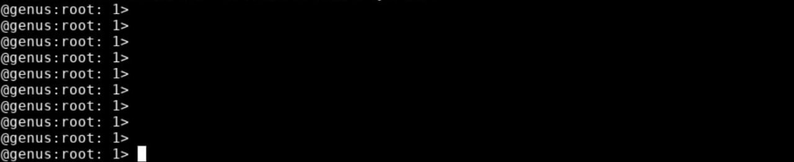
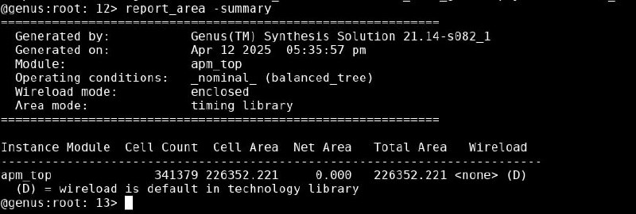

[[_genus_sta]]
== Руководство по работе с STA в Genus

:toc:
:toc-title: Оглавление
:toclevels: 3

== Введение

Цель статического временного анализа (STA) заключается в том, чтобы для каждого пути (path) между двумя последовательными элементами рассчитать задержки распространения сигналов и установить, выполняются ли два ограничения:

. Данные от триггера FF1 должны распространяться достаточно быстро, чтобы успеть дойти до триггера FF2 раньше защелкивающего фронта (максимальное время распространения);
. Следующие данные от триггера FF1 должны распространяться достаточно медленно, чтобы защелкивающий фронт успел дойти до триггера FF2 и 
захватить предыдущие данные от триггера FF1 (минимальное время распространения)

image::img/img_ff.svg[Scalable Vector Diagram, width=90%] 

Или другими словами, можно ввести термины

Setup Time (время установки) – максимально допустимая задержка пути (path delay), при которой данные успевают стабилизироваться на входе приемника до следующего тактового фронта.

Условие: T_clock ≥ T_prop_max + T_setup

T_prop_max - максимальное время распространения сигнала
Если это условие нарушается, данные могут быть пропущены.

Hold Time (время удержания) – минимально допустимая задержка пути, при которой данные не изменяются слишком быстро после тактового фронта, чтобы избежать "захвата" некорректного значения.

Условие: T_prop_min ≥ T_hold

T_prop_min - минимальное время распространения сигнала
Если это условие нарушается, возможна гонка сигналов.

Если вкратце, то:

. Setup time гарантирует, что данные придут до следующего тактового фронта.

. Hold time гарантирует, что данные останутся стабильными после текущего тактового фронта.

**Hold time на логическом синтезе не анализируется**

Результат работы статического анализатора представляется в виде запаса по времени для задержки данных (Slack). Положительный Slack указывает на то, что данные доходят до места назначения раньше, чем это требуется. Отрицательное значение Slack означает нарушение ограничения по Setup.

### Базовые команды для отладки STA 

После завершения синтеза, при открытии базы синтеза(См. <<genus.adoc#>>. [Раздел "Используемые тагреты make"] ) или при остановке синтеза в терминале будет доступна командная строка Genus:

В ней можно вводить команды, которые описаны ниже:

* `report_summary` - выводит репорт по таймингам и площади на каждом из этапов логического синтеза, с учетом всех временных групп(reg2reg, in2reg, reg2out, in2out), а еще мощность утечек(leakage) и количество всех инстансов в дизайне.

.**Что такое группы?**
[%collapsible]
====
В STA группы путей (path groups) — это категории временных путей, которые анализируются отдельно для удобства проверки временных ограничений. Основные группы включают in2reg, reg2reg, reg2out, и in2out. Они определяют, между какими типами элементов распространяются сигналы:

* **in2reg (Input-to-Register)** - пути от входных портов до регистров.

Проверяется время, за которое сигнал с входа чипа успевает достичь регистра до тактового импульса (setup time).

Учитывается задержка на комбинационной логике между входом и регистром.

* **reg2reg (Register-to-Register)** - пути между двумя регистрами.

Проверяется Setup между последовательными регистрами и критический путь (max delay) для определения максимальной рабочей частоты.

* **reg2out (Register-to-Output)** - пути от регистра до выходного порта (output port).

Проверяется успевает ли сигнал с регистра стабилизироваться на выходе чипа до окончания тактового цикла. Так же учитывается задержка комбинационной логики после регистра.

* **in2out (Input-to-Output)** - пути от входного порта до выходного порта без прохождения через регистры (чисто комбинационная логика).

Проверяется задержка сигнала через комбинационную цепь (например, в асинхронных схемах). Может отсутствовать в синхронных проектах, где все пути проходят через регистры.
====

* `report_timing`
 
Для того чтобы понять с каким Slack закрывается ваш дизайн, можно ввести команду `report_timing` по умолчанию она выдает самый худший путь по сетапу.

Здесь главным образом стоит обратить внимение на Slack и пути(paths) - Startpoint и Endpoint (Начальная точка (например, триггер или входной порт) и конечная точка (триггер или выходной порт)) и группу, где происходит нарушение(in2reg или другие)

Помимо этого тоже самое можно сделать в gui Genus, сперва выгрузите отчет о путях следующей командой:

`report_timing -max_path 40 -output_format mtarpt > top`

вместо top можете выбрать любую директорию, предыдущая же команда просто сгенерирует файл top.mtarpt в директории Genus

Откройте гуи Genus командой
`gui_show`

Откройте вкладку Timing -> Debug Timing 

Выберите сгенерированный файл, **отключите опцию Generate**, если она включена, нажмите ОК

В появившемся окне можно увидеть найденные худшие пути

Нажав 2 раза по выбранному пути можно увидеть в появившемся окне полную информацию по нарушениям в пути, включая Slack, Start/end point, можно нажать на вкладку Schematic и посмотреть путь на схеме после синтеза.

* `report_area` - по умолчанию выводит ВЕСЬ иерархический список модулей дизайна, инстансов, количества ячеек(Cell count), их площадь(Cell area) в микрометрах квадратных, и площади межсоединений(Net Area)

Используй ключ -depth для настройки глубины иерархии, например: 
`report_area -depth 1` выдаст следующую иерархию:

Опция `-summary` показывает характеристику площади топового уровня дизайна

Опция `-detail` выводит подробный отчет дизайна по площадям. Здесь показываются в частности занимаемый объем комбинационной логики, флопов в каждом из модулей.

Выше описаны базовые команды и их ключи для дебага синтеза, однако всегда можно использовать man <command> чтобы увидеть все возможные опции для команд.

Так же доступна цель для открытия cadence help, в ней доступно тоже самое.
Для его открытия необходимо прописать 
`make syn_cdnshelp`

. Появится такое окно, жмем ok
+

. После этого заходим в настройки (Ctrl+K или три точки в правом углу)
+

. Откроется меню настроек, переходим в вкладку Library
+

. Нажмите синюю кнопку "Add Library"
+

. В появившемся окне вводим в поле Directory /local/tools/cadence/GENIUS/21.14/doc и жмем choose
+

. Вернувшись в меню настроек можно увидеть добавление документации Genus в соответсвующее поле, следует включить слайдер в активное состояние и обязательно нажать `OK`
+

. После этого можно выйти из меню настроек и в общем поиске ввести любую интересующую команду Genus (убедитесь что стоит галочка all libraries справа от поиска)
+

