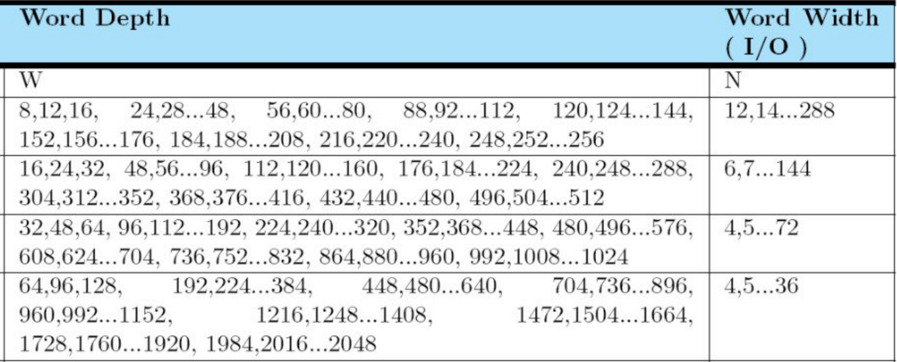
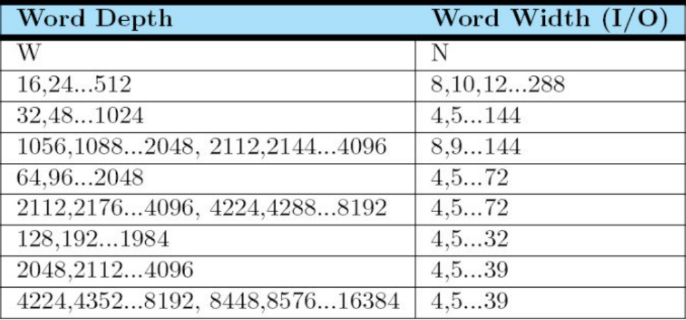
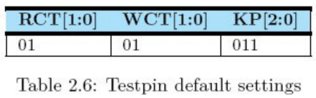

[[_mem]]
= Hard Macro памяти

:toc:
:toc-title: Оглавление
:toclevels: 3

== Зачем использовать hard macro памяти?

Когда ты описываешь память (регистровый файл) в rtl, то до определенного размера (примерно 1 КБ) она синтезируется в приемлемую по задержкам, количеству комбинационной логики и площади структуру.

Чем больше регистровый файл, тем хуже характеристики схемы. Для создания больших памятей используются компиляторы. Компилятор создает структуру (hard macro) из специальных ячеек, которые меньше по размеру и располагаются плотнее. Скомпилированная память по сравнению с регистровым файлом такого же объема хранения имеет лучший тайминг, занимает меньше места на кристале и потребляет меньше энергии.

WARNING: В скомпилированных памятях чаще встречаются ошибки при изготовлении на фабрике, поэтому их использование - компромисс между оптимизацией и надежностью.

== Компиляция памяти

Набор готовых памятей уже доступен на сервере для интеграции. они находятся в `tools\SAED_14\mem\`

Библиотеки для синтеза лежат в `tools\SAED_14\mem\NLDM\`

Модели памяти для симуляции лежат в `tools\SAED_14\mem\VERILOG\FPGA\`

Компиляции памяти - сложный процесс. Для экономии времени память для тебя подготовит организатор хакатона по запросу.

. Найди контакт организатора, отвечающего за памяти. Его ник будет закреплен (pin) в топике `RTL-проектирование` чата `Хакатон SoC Design Challenge 2025`
. Напиши запрос в формате: `Нужна ОДНОПОРТОВАЯ (spram) / ДВУХПОРТОВАЯ (tpram) память WIDTH x DEPTH`
. Организатор ответит когда память будет добавлена в общий пул

[TIP]
====
Компиляция памяти занимает время (примерно 1 час). Время может увеличиваться из-за количества запросов и загрузки сервера. Чтобы сберечь себе время, используй регистровый файл, написанный на hdl, для симуляции и отладки. А hard macro память запроси на этапе синтеза.
====

== Параметры памяти

Не все комбинации `WIDTH` и `DEPTH` доступны для компиляции. Ознакомься с таблицами для выбора доступных размеров:

.Доступные размеры для двухпортовых памятей (tpram)

.Доступные размеры для однопортовых памятей (spram)

== Добавление памяти в систему сборки

Для симуляции добавь *абсолютный* путь, полученный от организатора, до verilog *модели памяти* в файл `lst/files_mem_verilog.lst`.

WARNING: Не добавляй путь до verilog модели памяти в файл `lst/files_rtl_verilog.lst`. Файлы из этого листа должны быть синтезируемыми.

Для синтеза добавь *абсолютный* путь, полученный от организатора, до .lib файла в файл `lst/files_mem_lib.lst`.

== Инстанцирование hard macro памяти в RTL

Память инстанцируется как verilog модуль.

Часть портов тебе не понадобится. Используй стандартные значения:

