# Single Port SRAM Specification

## Specification

### 1 Block Diagram

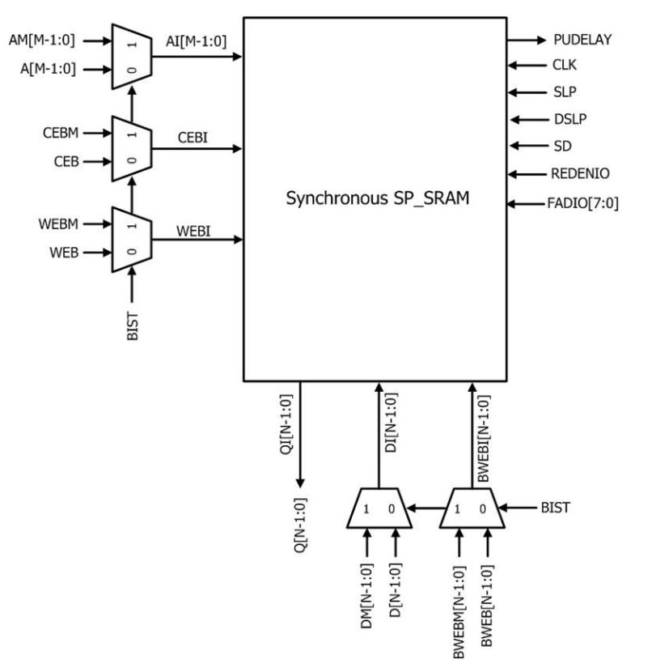

**Figure 1**: Block diagram of Single Port SRAM

**Note 1**: testpins: `RTSEL`, `WTSEL`

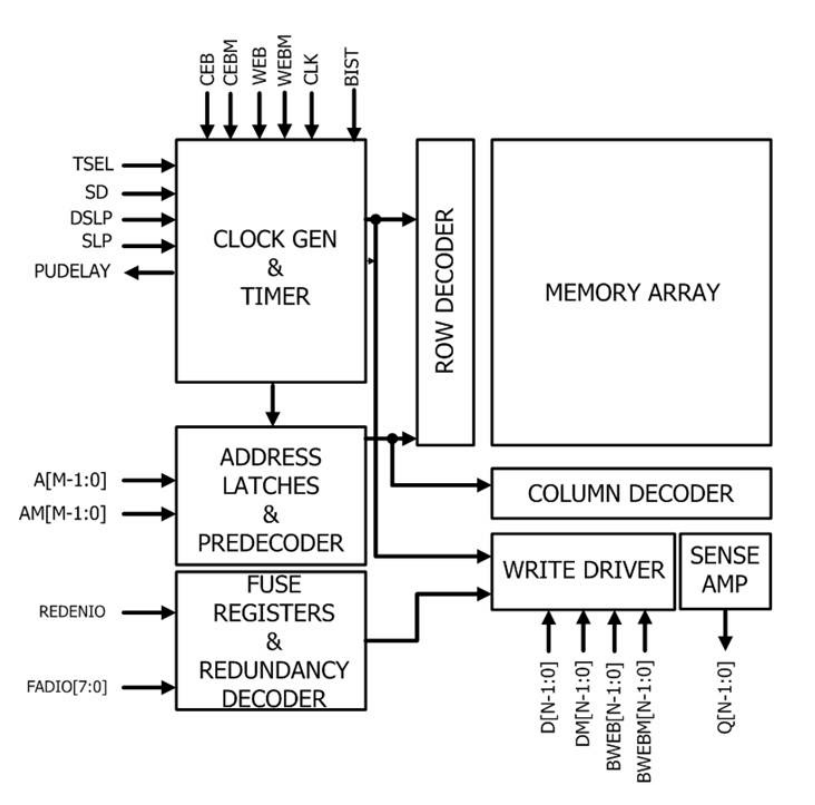

**Figure 2**: Internal Function Block Diagram of Single Port SRAM

**Note 1**: testpins: `RTSEL`, `WTSEL`

### 2 Function

The Single Port SRAM is synchronized and triggered by a clock rising edge, CLK. Input address A, input data D, chip enable CEB, and write enable WEB are latched by the rising edge of the clock. The following explains major operation of the Single Port SRAM.  

#### Read-only Operation
The chip enable pin, CEB must be low and write-enable pin, WEB stays high at CLK rising edge. The read operation accesses the memory bits specified by address `A[M-1:0]` and places the data outputs on bus  `Q[N-1:0]` after the read access time.  

#### Write-only Operation
The write-enable pin, WEB must be low and chip enable pin, CEB stays low at CLK rising edge. Data on bus `D[N-1:0]` is written into memory bits specified by address `A[M-1:0]`. The bit-write mask feature is controlled by bus BWEB[N-1:0]. The data bit is not written into the memory when the corresponding BWEB pin is set to high.  

#### Sleep Mode
The sleep mode enable pin, SLP must be high to enter sleep mode after memory is disabled by CEB high. It reduces standby leakage by switching off the power supply to part of periphery circuit while the bit cell power is sustained at full VDD. Thus the memory content is retained during the sleep mode.  

#### Deep Sleep Mode
The deep sleep mode enable pin, DSLP must be high to enter sleep mode after memory is disabled by CEB high. It reduces standby leakage by switching off the power supply to part of periphery circuit while the bit cell power is sustained at lower VDD. Thus the memory content is retained during the deep sleep mode.  

#### Shut Down Mode
The Shut down enable pin, SD must be high to enter shut down mode after memory is disabled by CEB high. It reduces most standby leakage by switching off the power supply to most of periphery circuit and whole bit cell array. Thus the memory content will be corrupted after entering this mode.  

#### Dual Rail
Level shifters are built-in at the macro input interface to convert the input pin voltage level from VDD to VDDM, the power voltage supplies inner memory periphery and bitcell array. This feature allows SOC to operate at a different voltage level from SRAM macro.  

#### Redundancy
Column redundancy is built-in for repairing defect bit cells. To start the repair function, the defective IO number must be addressed by parallel in redundancy input pins. Once repair function is activated, the defective IO of columns will be replaced by the redundant IO.  

### 3 Compiler Range Information

Single Port SRAM memory macro can be configured by column mux option (CM), number of words (W), and number of bits per word (N). The valid range of these parameters is specified in the Table 1.  

| Segment Option | Mux Option | Word Depth | Word Width (I/O) |
| --- | --- | --- | --- |
| SGE | CM | W | N |
| S | 2 | 16, 24 … 512 | 8, 10, 12 … 288 |
| S | 4 | 32, 48 … 1024 | 4, 5 … 144 |
| S | 4 | 1056, 1088 … 2048, 2112, 2144 … 4096 | 8, 9 … 144 |
| S | 8 | 64, 96 … 2048 | 4, 5 … 72 |
| S | 8 | 2112, 2176 … 4096, 4224, 4288 … 8192 | 4, 5 … 72 |
| S | 16 | 128, 192 … 1984 | 4, 5 … 32 |
| S | 16 | 2048, 2112 … 4096 | 4, 5 … 39 |
| S | 16 | 4224, 4352 … 8192, 8448, 8576 … 16384 | 4, 5 … 39 |

**Table 1**: Configuration Range

### 4 Pin Description

Refer to Table 2 for detail pin description.

| Pin | Type | Description |
| --- | --- | --- |
| VDD | Supply | Power bus |
| VDDM | Supply | Power bus |
| VSS | Supply | Ground bus |
| $\mathrm{A}[\mathrm{M}-1:0]$ | Input | Address input |
| $\mathrm{AM}[\mathrm{M}-1:0]$ | Input | Address input |
| $\mathrm{D}[\mathrm{N}-1:0]$ | Input | Data input |
| $\mathrm{DM}[\mathrm{N}-1:0]$ | Input | Data input |
| CLK | Input | Clock input |
| CEB | Input | Chip enable, active low |
| CEBM | Input | Chip enable for BIST, active low |
| WEB | Input | Write enable, active low |
| WEBM | Input | Write enable for BIST, active low |
| BWEB[N-1:0] | Input | Bit write enable, active low |
| BWEB[M-1:0] | Input | Bit write enable for BIST, active low |
| BIST | Input | BIST interface Enabled |
| SLP | Input | Sleep mode, active high |
| DSLP | Input | Peripheral circuit is powered down for leakage reduction and memory array content is retained with lower voltage |
| SD | Input | Shut down mode, active high |
| REDENIO | Input | Column repair enable, active high |
| FADIO[7:0] | Input | Faulty IO address input |
| RTSEL[1:0] | Input | Timing adjustment setting for debugging purpose |
| WTSEL[1:0] | Input | Timing adjustment setting for debugging purpose |
| PUDELAY | Output | A propagation signal from SD (shut-down) used for sequential wake-up control on multiple macros to reduce simultaneous peak current in chip level |
| Q[N-1:0] | Output | Data output |

**Table 2**: Pin description

Refer to Table 3 and Figure 3. Compiler timing characterization and silicon verification are based on default setting. Only the test pin default setting is allowed for silicon characterization. The other settings are not allowed and tsmc does not characterize timing for other settings. The other setting combinations of logic state is used for debugging purpose only.  

| RTSEL[1:0]|
| --- |
| 01 |

**Table 3**: Testpin default settings for RTSEL

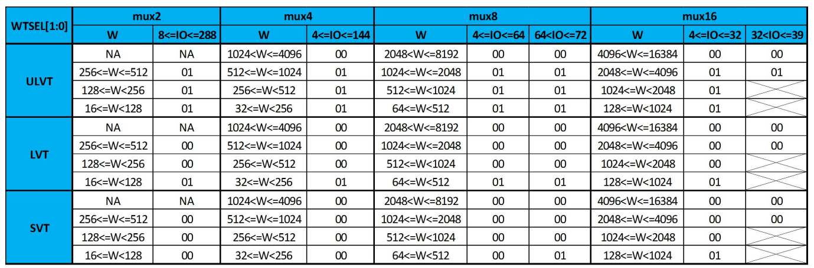

**Figure 3**: Testpin default setting for WTSEL   
Note : W(Word Depth)  

### 5 Logic Truth Table

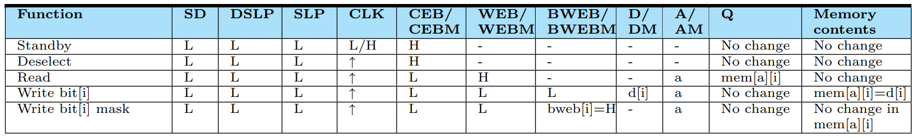

**Table 4**: Active Pins in Normal Function mode  

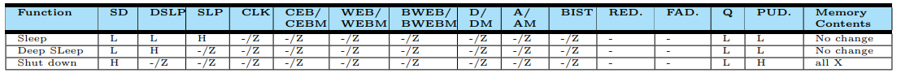

**Table 5**: Active Pins in Sleep, Deep Sleep and Shut down Modes  

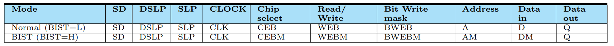

**Table 6**: Active Pins in BIST mode  

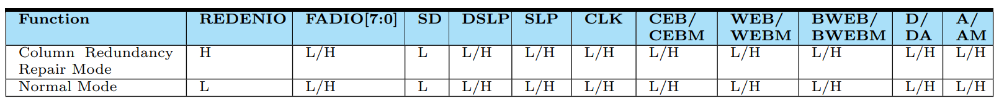

**Table 7**: Active Pins in Redundancy Function mode  

### 6 Hazard Conditions

Below pin combinations that do not exist in function truth table may cause unknown memory content or data output. User should be aware of or avoid these combinations. Refer to Table 8 for SRAM hazard conditions.   

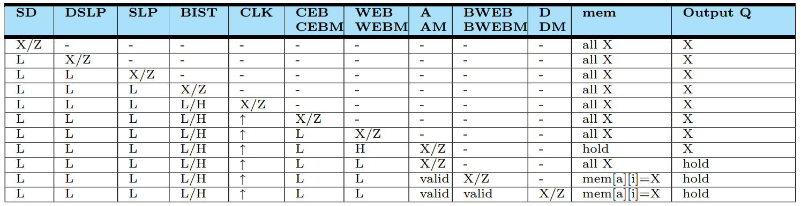

**Table 8**: SRAM hazard conditions  

Below pin combinations that do not exist in repair function truth table may cause unknown memory content or data output. User should be aware of or avoid these combinations. Refer to Table 9 for redundancy hazard conditions.  

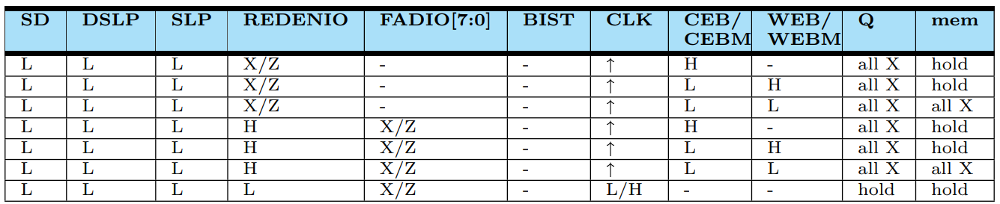

**Table 8**: SRAM hazard conditions: Redundancy fuse setting cycle  

**Terms used in the above truth or hazard tables**   
**Condition:**  
-  L : logic low  
-  H : logic high  
-  X : unpredictable data, it can be either ”0” or ”1” but not deterministic  
-  Z : high impedance  
-  - : L, H, X, not include Z  
-  valid : stable ( could be 0 or could be 1 ) in fixed condition  
-  ↑: signal rising edge   

**Output Q:**  
-  hold : keep previous state   
-  X : unpredictable data, it can be either ”0” or ”1” but not deterministic  
-  L : logic low  
-  data-out : output of normal read function   

**Mem:**   
-  mem[a] = X : memory content is unpredictable at the specific memory address A   
-  mem[a][i] = X : memory content is unpredictable at the specific memory address A and specific IO  
-  hold : keep the previous state  
-  all X : all memory contents are unpredictable  

### 7 Timing Parameter

- The maximum slew for each input signal is 0.580 ns
- All timing is measured from a logic threshold at 50% of the power supply
- Slew rates are measured from 10% to 90% of the power supply

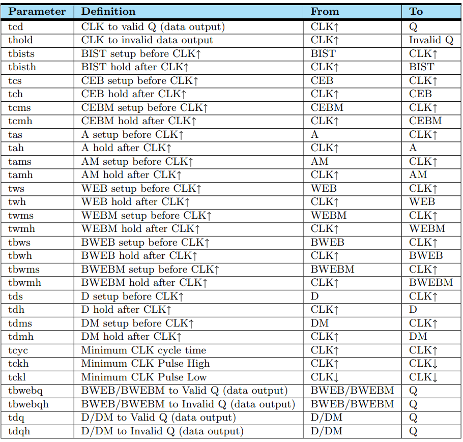

**Table 9**: Timing specification symbols and definitions  

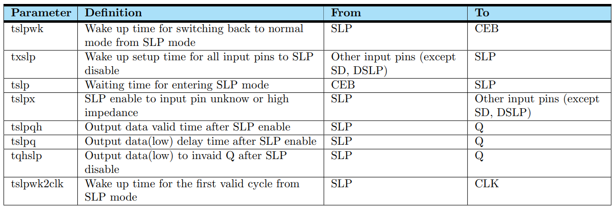

**Table 10**: Timing Specification for Sleep Mode   

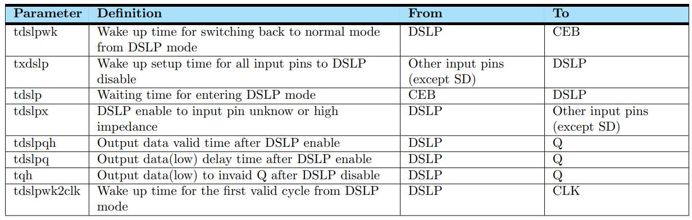

**Table 11**:  Timing Specification for Deep Sleep Mode    

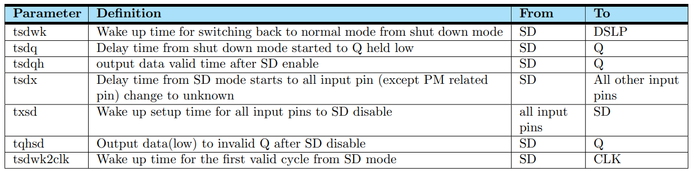

**Table 12**:  Timing specification for Shut Down mode   

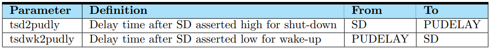

**Table 13**:   Timing Specification for PUDELAY pin     

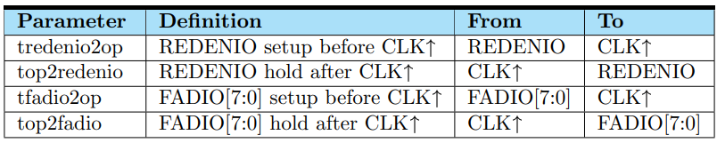

**Table 14**:  Timing Specification for Redundancy Mode     

### 2.4.8 Timing Waveform

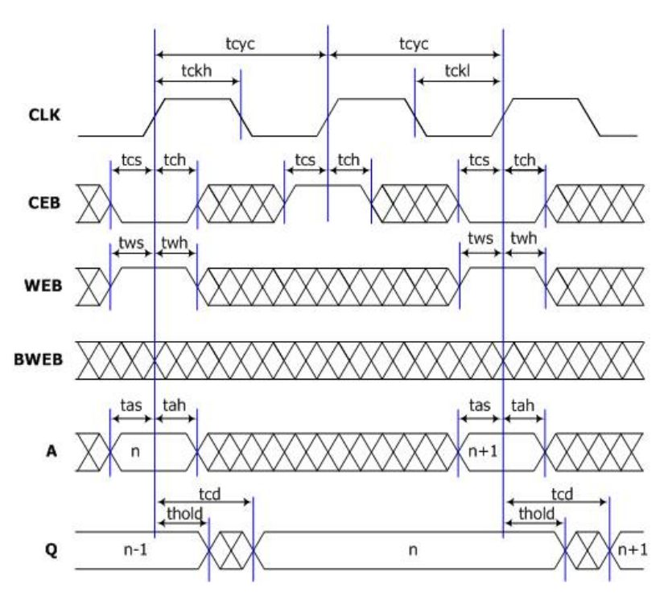

**Figure 4**: Timing protocol of SRAM Read-only operation

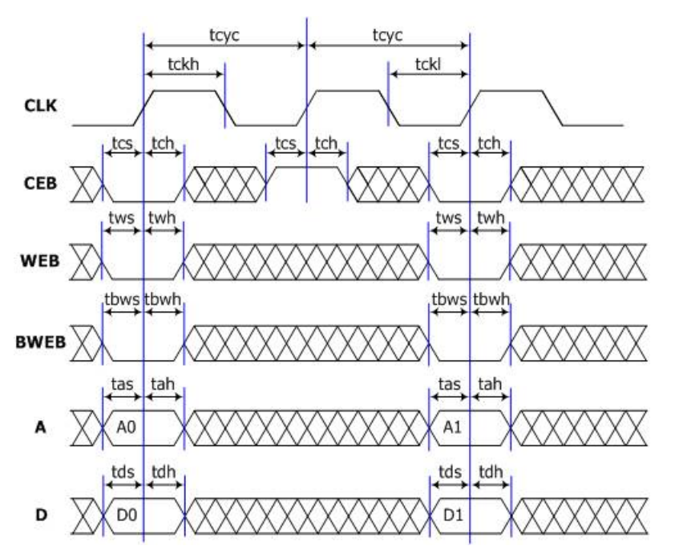

**Figure 5**: Timing protocol of SRAM Write-only operation

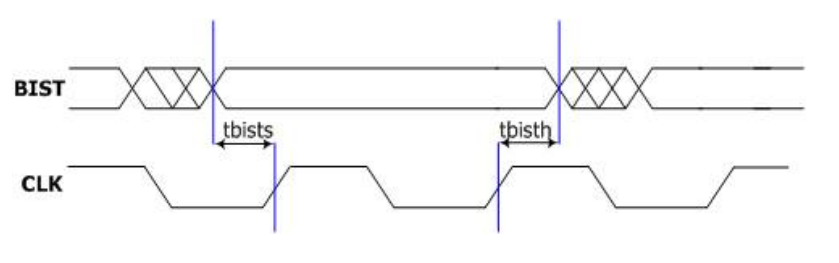

**Figure 6**: Timing protocol of BIST

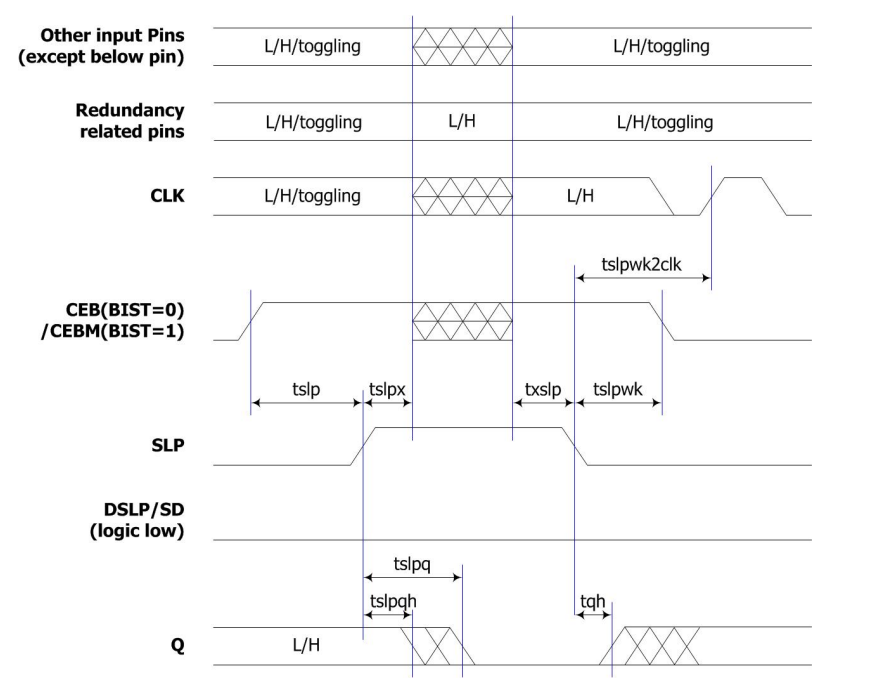

**Figure 7**: Timing protocol of the sleep mode

#### Sleep Mode behavior:
- SLP pin is an asynchronous control input pin.  
- SLP pin must be active high for entering sleep mode.  
- All input pins except SD, DSLP and Redundancy related pins can be floating or unknown (x) during sleep mode (SLP = 1'b1).  
- After SLP goes high (1'b1), tslpx timing shall be met before input pins become floating or unknown (x) states. Similarly, txslp timing shall be met before SLP goes low (1'b0) to ensure input pins are valid (0/1).  
- The chip enable signal (CEB) must be disabled with asserting high prior to entering sleep mode.
- SRAM wake up time from sleep mode to normal mode (tslpwk) is required and must be sufficiently guaranteed for instance to have healthy power supply.  
- The SRAM data output (Q) is logic low after SLP is activated (SLP = 1'b1) with certain waiting time, tslpq. While SLP is still activated, data output (Q) remains logic low.  
- The required timing 'tslp' guarantees the last CLK cycle read or write successfully when last CLK cycle latches CEB=”L”. Once 'tslp' is satisfied, CLK can be either L or H or toggled before SLP actives high.  

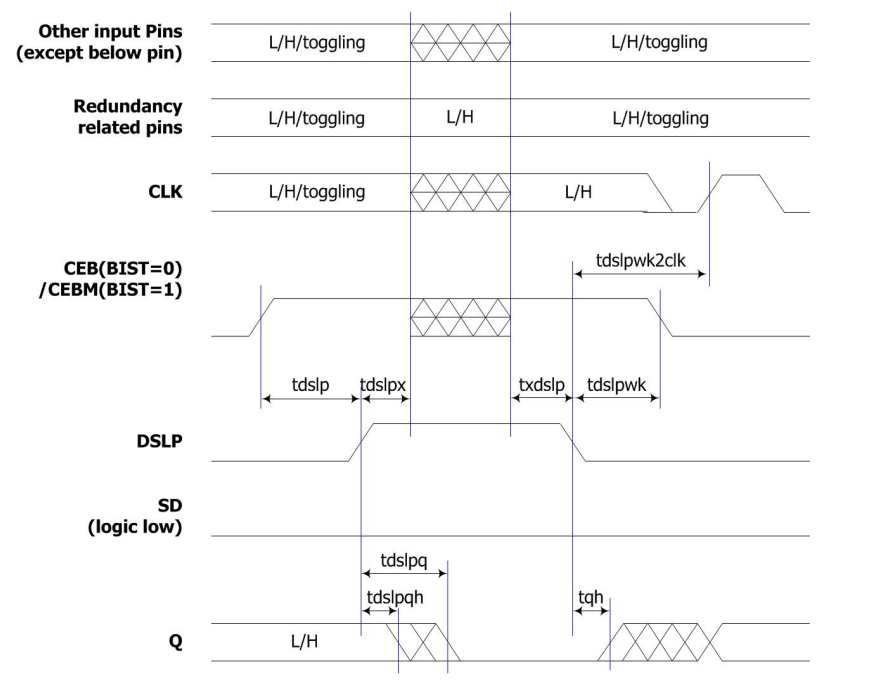

**Figure 8**: Timing protocol of the deep sleep mode  

#### Deep Sleep Mode behavior:
- DSLP pin is an asynchronous control input pin.  
- DSLP pin must be active high for entering deep sleep mode (1'b1 = power saving).  
- Prior to entering deep sleep mode, the memory macro must be disabled with CEB asserting high.
- Most of input pins can be floating or unknown (x) during deep sleep mode (DSLP = 1'b1) except SD and redundancy related pins.  
- After DSLP goes high (1'b1), tdslpx timing shall be met before input pins become floating or unknown (x) states. Similarly, txdslp timing shall be met before DSLP goes low (1'b0) to ensure input pins are valid (0/1).  
- The SRAM data output (Q) is logic low after DSLP is activated (DSLP = 1'b1) with certain waiting time, tdslpq. While DSLP is still activated, data output (Q) remains logic low.  
- SRAM wake up time from deep sleep mode to normal mode (tdslpwk) is required and must be sufficiently guaranteed for instance to have healthy power supply.  
- The required timing 'tdslp' guarantees the last CLK cycle read or write successfully when last CLK cycle latches CEB=”L”. Once 'tdslp' is satisfied, CLK can be either L or H or toggled before DSLP actives high.  

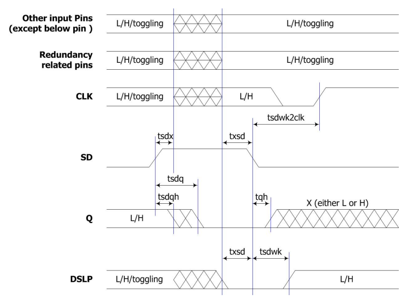

**Figure 9**: Timing protocol of the shut down mode

#### Shut Down Mode behavior:
- SD pin is an asynchronous control input pin.  
- SD pin must be active high.  
- All input pins except SD can be floating or unknown (X) during shut down mode (SD=1'b1).
- After SD goes high (1'b1), tsdx timing shall be met before input pins become floating or unknown (x) states. Similarly, txsd timing shall be met before SD goes low (1'b0) to ensure input pins are valid(0/1).  
- SRAM wake up time from shut down mode to normal stand-by mode (tsdwk) is required and must be sufficiently guaranteed for instance to have healthy power supply.  
- The SRAM data output (Q) is logic low after SD is activated (SD = 1'b1) with certain waiting time, tsdq. While SD is still activated, data output (Q) remains logic low.  
- When the values of data output (Q) changes from logic low (shut down mode) to unknown-X (normal stand-by mode), there is no high-Z on output Q.  
- In order to have DSLP wake-up time of macro behavior match tdslpwk exactly, a condition of no entering DSLP mode is required while still in process of SD waking up.  
  - DSLP must remain asserted low while macro waking up from shut-down mode with SD being asserted low.  
  - Timing value of tdslpwk/tdslpwk2clk is invalid for simulation if DSLP asserted high while in SD waking up process within tsdwk period (SD=low), instead, tdslpwk/tdslpwk2clk is replaced with tsdwk/tsdwk2clk while in simulation.  

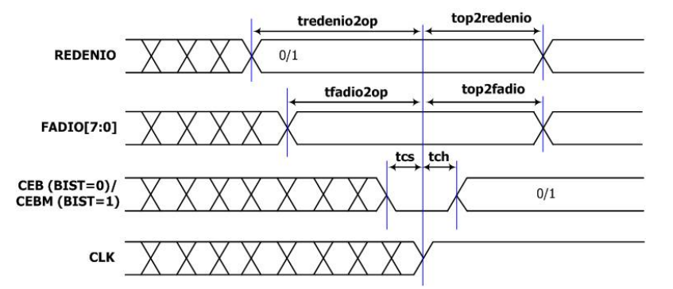

**Figure 10**: Timing protocol Redundancy

**Redundancy behavior:**  
- If REDENIO toggles, or FADIO[7:0] toggle when REDENIO=1'b1, Q will become X.  
- If REDENIO toggles, or FADIO[7:0] toggle when REDENIO=1'b1 during write operation(WEB=L), memory contents will become X.  

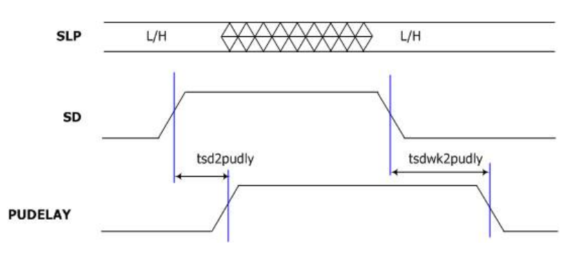

**Figure 11**: Timing protocol of macro wake up/shut down vs PUDELAY

#### PUDELAY behavior:
- The PUDELAY is logic high after SD goes high with certain waiting time, tsd2pudly  
- The PUDELAY is logic low after SD is disabled with certain waiting time, tsdwk2pudly  