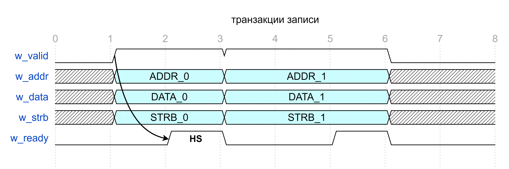
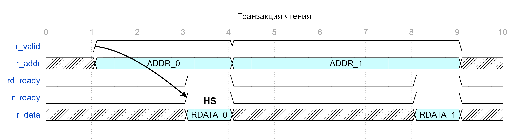

## Модуль интерфейса шины ADDRDATA

#### Список сигналов интерфейса:

```verilog

  ////////////////////////////////////////////////////////////
  //                      Write channel                     //
  ////////////////////////////////////////////////////////////

  logic               w_valid;
  logic               w_ready;
  logic [AXI_A_W-1:0] w_addr;
  logic [AXI_D_W-1:0] w_data;
  logic [AXI_S_W-1:0] w_strb;

  ////////////////////////////////////////////////////////////
  //                      Read channel                      //
  ////////////////////////////////////////////////////////////

  logic               r_valid;
  logic               r_ready;
  logic              rd_ready;
  logic [AXI_A_W-1:0] r_addr;
  logic [AXI_D_W-1:0] r_data;
```

---
---

#### Канал записи:

  * w_valid — ***Валидность выставляемого MASTER-ом адреса***
  * w_ready — ***Готовность SLAVE-а считать адрес***
  * w_addr  — ***Адрес выставляемый MASTER-ом***
  * w_data  — ***Данные выставляемые MASTER-ом***
  * w_strb  — ***Байтовая валидность выставляемых MASTER-ом данных***

---

#### Канал чтения:

  * r_valid  — ***Валидность выставляемого MASTER-ом адреса***
  * r_ready  — ***Готовность SLAVE-а***
  * rd_ready — ***Готовность MASTER-а принять данные***
  * r_addr   — ***Адрес для чтения выставляемый MASTER-ом***
  * r_data   — ***Данные для чтения выставленные SLAVE-ом***

---

#### Пример транзакция записи:



---

#### Пример транзакция чтения:



---
---

#### Подключение со стороны MASTER устройства:

```verilog
  ////////////////////////////////////////////////////////////
  //                      Master Side                       //
  ////////////////////////////////////////////////////////////

  modport Master
  (

    // Write channel:
    output w_valid, output w_addr, output w_data, output w_strb,
    input  w_ready, /*input  w_resp,*/

    // Read  channel:
    output r_valid, output r_addr, output rd_ready,
    input  r_ready, input  r_data

  );

```

---

#### Подключение со стороны SLAVE устройства:

```verilog
  ////////////////////////////////////////////////////////////
  //                       Slave Side                       //
  ////////////////////////////////////////////////////////////

  modport Slave
  (

    // Write channel:
    input  w_valid, input  w_addr, input w_data, input w_strb,
    output w_ready, /*output w_resp,*/

    // Read  channel:
    input  r_valid, input  r_addr, input rd_ready,
    output r_ready, output r_data

  );
```

---
---