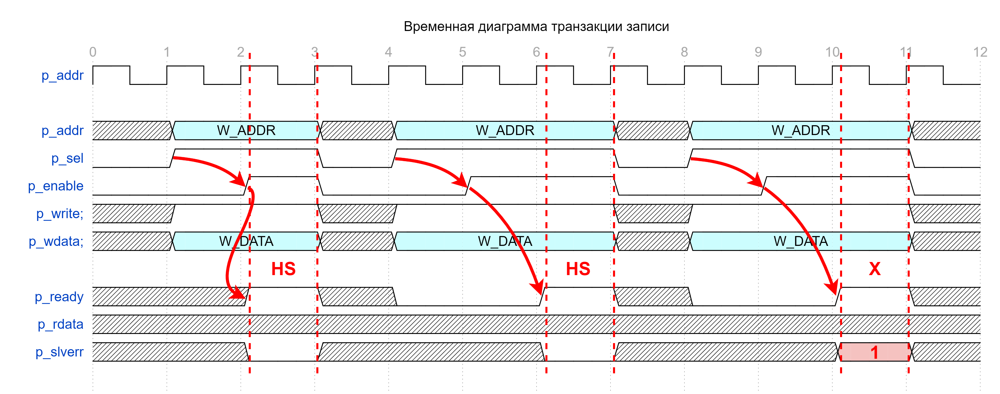
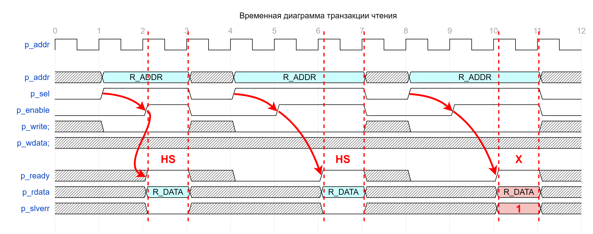

## Модуль ABP шины

#### Список сигналов интерфейса:

```verilog
  ////////////////////////////////////////////////////////////
  //                       APB bridge                       //
  ////////////////////////////////////////////////////////////

  logic [APB_A_W-1:0] p_addr;   // address
  logic               p_sel;    // 1-slave
  logic               p_enable; // second and subsequent cycles of an APB transfer
  logic               p_write;  // 1-WRITE / 0-READ
  logic [APB_D_W-1:0] p_wdata;

  ////////////////////////////////////////////////////////////
  //                     Slave interface                    //
  ////////////////////////////////////////////////////////////

  logic               p_ready;
  logic [APB_D_W-1:0] p_rdata;
  logic               p_slverr;
```

---
---

#### APB bridge:

  * p_addr — ***Адрес для чтения/записи в CSR***
  * p_sel — ***Флаг Select выбирает конкретное SLAVE устройство, подключенное к шине APB. В данной реализации выставление p_sel == 1'b1 подразумевает, что все остальные данные в канале APB bridge валидны и предназначаюится CSR-у.***
  * p_enable — ***Флаг поднимается на второй и последующие такты передачи по APB***
  * p_write — ***Флаг, определяющий тип транзакции: 0 - READ, 1 - WRITE***
  * p_wdata — ***Данные для записи (p_write == 1'b1)***

#### Slave interface:

  * p_ready — ***Флаг готовности CSR к приёму данных от MASTER устройства***
  * p_rdata — ***Данные для чтения (p_write == 1'b0)***
  * p_slverr — ***Флаг, сигнализирующий об ошибке чтения/записи в CSR (попытка обращения к нереализованным адресам, попытка записи в Read-only регистраы)***

---
---

#### Пример транзакции записи:



**Транзакция без задержки:**

На первом такте выставляются:
 - Адрес для записи **p_addr**;
 - Флаг **p_sel == 1**;
 - Тип транзакции, в данном случае — запись **p_write == 1**;
 - Данные для записи **p_wdata**;

На втором такте выставляются:
 - **p_enable == 1 && p_ready == 1** (произошёл handshake);

---

**Транзакция с задержкой:**

На первом такте выставляются:
 - Адрес для записи **p_addr**;
 - Флаг **p_sel == 1**;
 - Тип транзакции, в данном случае — запись **p_write == 1**;
 - Данные для записи **p_wdata**;

На втором такте выставляется:
 - **p_enable == 1** — всегда выставляется на втором такте и ождидает поднятия **p_ready**;

На N-м такте выставляются:
 - **p_enable == 1 && p_ready == 1** (произошёл handshake);

---

**Транзакция с ошибкой:**

На первом такте выставляются:
 - Адрес для записи **p_addr**;
 - Флаг **p_sel == 1**;
 - Тип транзакции, в данном случае — запись **p_write == 1**;
 - Данные для записи **p_wdata**;

На втором такте выставляется:
 - **p_enable == 1** — всегда выставляется на втором такте и ождидает поднятия **p_ready**;

На N-м такте выставляются:
 - **p_enable == 1 && p_ready == 1** (произошёл handshake);
 - Во время транзакции на стороне SLAVE произошла ошибка **p_slverr == 1**

---
---

#### Пример транзакции чтения:



**Транзакция без задержки:**

На первом такте выставляются:
 - Адрес для чтения **p_addr**;
 - Флаг **p_sel == 1**;
 - Тип транзакции, в данном случае — чтение **p_write == 0**;

На втором такте выставляются:
 - **p_enable == 1 && p_ready == 1** (произошёл handshake);
 - Выставляются валидные данные для чтения **p_rdata**;

---

**Транзакция с задержкой:**

На первом такте выставляются:
 - Адрес для чтения **p_addr**;
 - Флаг **p_sel == 1**;
 - Тип транзакции, в данном случае — чтение **p_write == 0**;

На втором такте выставляется:
 - **p_enable == 1** — всегда выставляется на втором такте и ождидает поднятия **p_ready**;

На N-м такте выставляются:
 - **p_enable == 1 && p_ready == 1** (произошёл handshake);
 - Выставляются валидные данные для чтения **p_rdata**;

---

**Транзакция с ошибкой:**

На первом такте выставляются:
 - Адрес для чтения **p_addr**;
 - Флаг **p_sel == 1**;
 - Тип транзакции, в данном случае — чтение **p_write == 0**;

На втором такте выставляется:
 - **p_enable == 1** — всегда выставляется на втором такте и ождидает поднятия **p_ready**;


На N-м такте выставляются:
 - **p_enable == 1 && p_ready == 1** (произошёл handshake);
 - Данные не валидны **p_rdata**;
 - Во время транзакции на стороне SLAVE произошла ошибка **p_slverr == 1**

---
---

#### Подключение со стороны MASTER устройства:

```verilog
  ////////////////////////////////////////////////////////////
  //                      Master Side                       //
  ////////////////////////////////////////////////////////////

  modport Master
  (

    // APB bridge
    output p_addr, output p_sel, output p_enable, output p_write, output p_wdata,

    // Slave interface
    input p_ready, input p_rdata, input p_slverr

  );
```

---

#### Подключение со стороны SLAVE устройства:

```verilog
  ////////////////////////////////////////////////////////////
  //                       Slave Side                       //
  ////////////////////////////////////////////////////////////

  modport Slave
  (

    // APB bridge
    input p_addr, input p_sel, input p_enable, input p_write, input p_wdata,

    // Slave interface
    output p_ready, output p_rdata, output p_slverr

  );
```

---
---