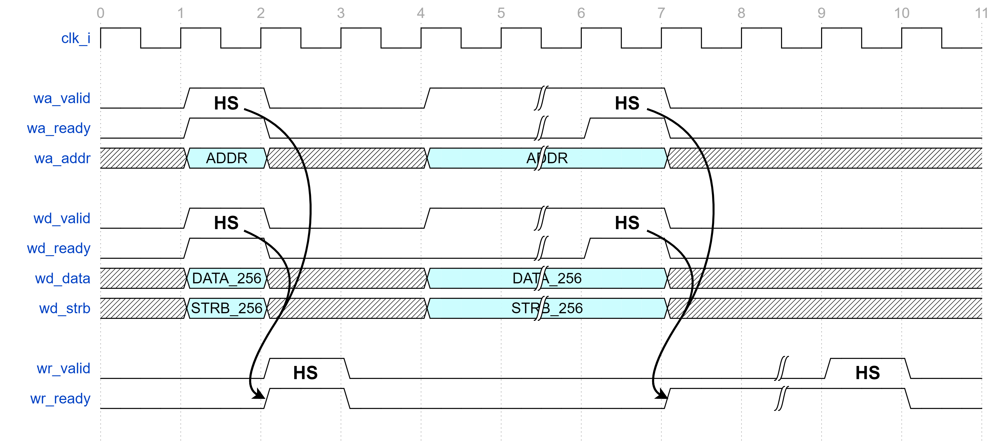
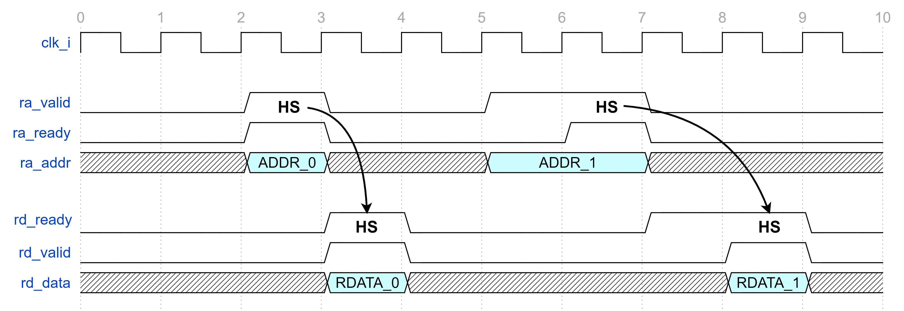

## Модуль интерфейса шины AXI4-Lite

#### Список сигналов интерфейса:

```verilog

  ////////////////////////////////////////////////////////////
  //                 Write address channel                  //
  ////////////////////////////////////////////////////////////

  logic               wa_valid;
  logic               wa_ready;
  logic [AXI_A_W-1:0] wa_addr;

  ////////////////////////////////////////////////////////////
  //                   Write data channel                   //
  ////////////////////////////////////////////////////////////

  logic               wd_valid;
  logic               wd_ready;
  logic [AXI_D_W-1:0] wd_data;
  logic [AXI_S_W-1:0] wd_strb; // byte enable

  ////////////////////////////////////////////////////////////
  //                 Write response channel                 //
  ////////////////////////////////////////////////////////////

  logic               wr_valid;
  logic               wr_ready;
//logic               wr_resp;

  ////////////////////////////////////////////////////////////
  //                  Read address channel                  //
  ////////////////////////////////////////////////////////////

  logic               ra_valid;
  logic               ra_ready;
  logic [AXI_A_W-1:0] ra_addr;

  ////////////////////////////////////////////////////////////
  //                   Read data channel                    //
  ////////////////////////////////////////////////////////////

  logic               rd_valid;
  logic               rd_ready;
  logic [AXI_D_W-1:0] rd_data;
//logic               rd_resp;
```

---
---

#### Канал записи адреса:

  * wa_valid — ***Валидность выставляемого MASTER-ом адреса***
  * wa_ready — ***Готовность SLAVE-а считать адрес***
  * wa_addr  — ***Адрес, выставляемый MASTER-ом***

---

#### Канал записи данных:

  * wd_valid — ***Валидность выставляемых MASTER-ом данных***
  * wd_ready — ***Готовность SLAVE-а считать данные***
  * wd_data  — ***Данные, выставляемые MASTER-ом***
  * wd_strb  — ***Байтовая валидность выставляемых MASTER-ом данных***

---

#### Канал подтверждения записи:

  * wr_valid — ***Подтверждение от SLAVE-а корректной записи данных***
  * wr_ready — ***Ожидание MASTER-ом подтверждения от SLAVE-а***
  * wr_resp — Упразднён в пользу ***wr_valid***

---

#### Пример транзакция записи:



---
---

#### Канал чтения адреса:

  * ra_valid — ***Валидность выставляемого MASTER-ом адреса***
  * ra_ready — ***Готовность SLAVE-а считать адрес***
  * ra_addr — ***Валидность выставляемого MASTER-ом адреса***

---

#### Канал чтения данных:

  * rd_valid — ***Валидность выставляемых SLAVE-ом данных***
  * rd_ready — ***Готовность MASTER-а принять данные***
  * rd_data — ***Данные, выставляемые SLAVE-ом***
  * rd_resp — Упразднён в пользу ***rd_valid***

---

#### Пример транзакция чтения:



---
---

#### Подключение со стороны MASTER устройства:

```verilog
  ////////////////////////////////////////////////////////////
  //                      Master Side                       //
  ////////////////////////////////////////////////////////////

  modport Master
  (

    // Write address channel:
    output wa_valid, output wa_addr,
    input  wa_ready,

    // Write data channel:
    output wd_valid, output wd_data, output wd_strb,
    input  wd_ready,

    // Write response channel:
    input  wr_valid, /*input  wr_resp,*/
    output wr_ready,

    // Read address channel:
    output ra_valid, output ra_addr,
    input  ra_ready,

    // Read data channel:
    input  rd_valid, input  rd_data, /*input  rd_resp,*/
    output rd_ready

  );
```

---

#### Подключение со стороны SLAVE устройства:

```verilog
  ////////////////////////////////////////////////////////////
  //                       Slave Side                       //
  ////////////////////////////////////////////////////////////

  modport Slave
  (

    // Write address channel:
    input  wa_valid, input  wa_addr,
    output wa_ready,

    // Write data channel:
    input  wd_valid, input  wd_data, input  wd_strb,
    output wd_ready,

    // Write response channel:
    output wr_valid, /*output wr_resp,*/
    input  wr_ready,

    // Read address channel:
    input  ra_valid, input  ra_addr,
    output ra_ready,

    // Read data channel:
    output rd_valid, output rd_data, /*output rd_resp,*/
    input  rd_ready

  );
```

---
---