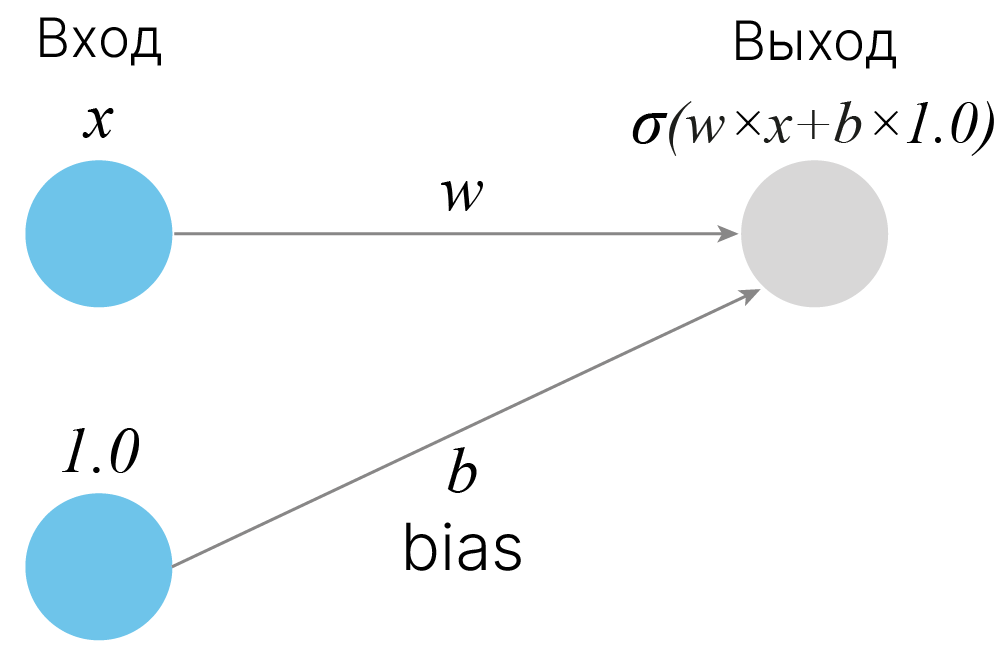

## Модуль смещения взвешенных сумм BIAS

Смещение (англ. BIAS) — это дополнительный коэффициент, прибавляющийся к взвешенной сумме входов. Наличие смещения позволяет сдвинуть функцию активации влево или вправо.

---

#### Схема смещения взвешенных сумм:



---

#### Формула:

$S = Σwx + b$, где:
* Σwx — взвешенная сумма, где:
  * w — веса
  * x — данные
* b — bias

---

#### Реализация:

```verilog
module npu_bi_o
  import npu_pkg::M_LEN;
(
  input  logic                    clk_i,
  input  logic                    arstn_i,

  input  logic signed [M_LEN-1:0] bias_i,

  input  logic signed [M_LEN-1:0] data_i,
  output logic signed [M_LEN-1:0] data_o,

  input  logic                    valid_i,
  output logic                    valid_o
);

  assign valid_o = valid_i;

  assign data_o = $signed(data_i) + $signed(bias_i);

endmodule
```

#### Сигналы:

* bias_i — ***Смещение***

---

* data_i — ***Взвешенная сумма***
* data_o — ***Результат смещения***

---

* valid_i — ***Валидность входных данных***
* valid_o — ***Валидность выходных данных***

---
---