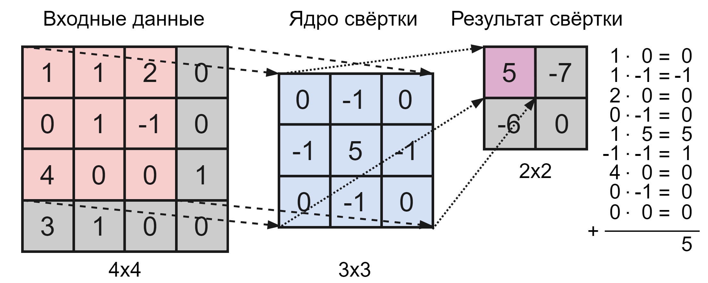
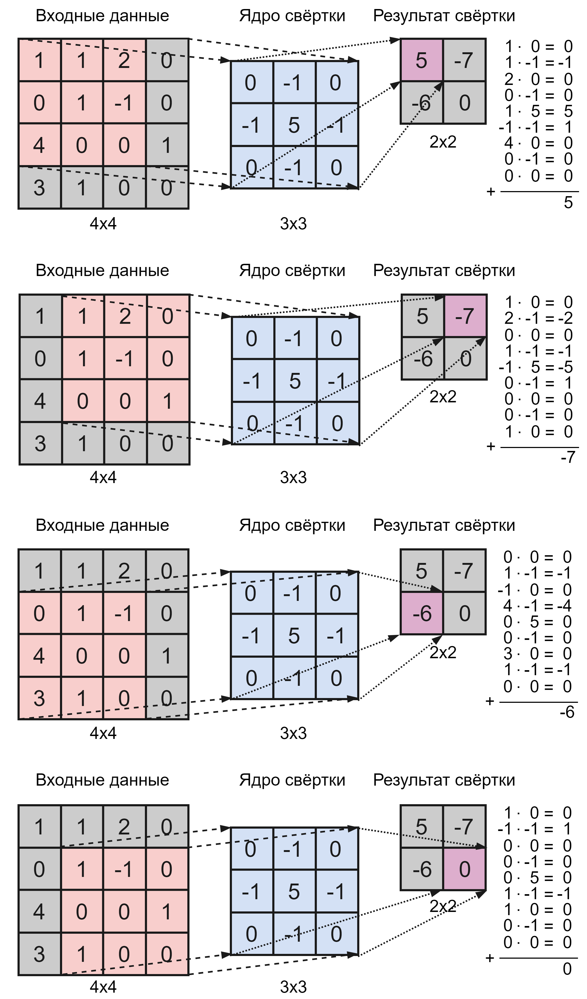
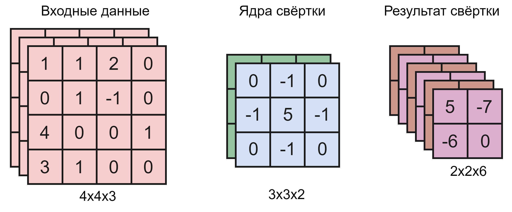
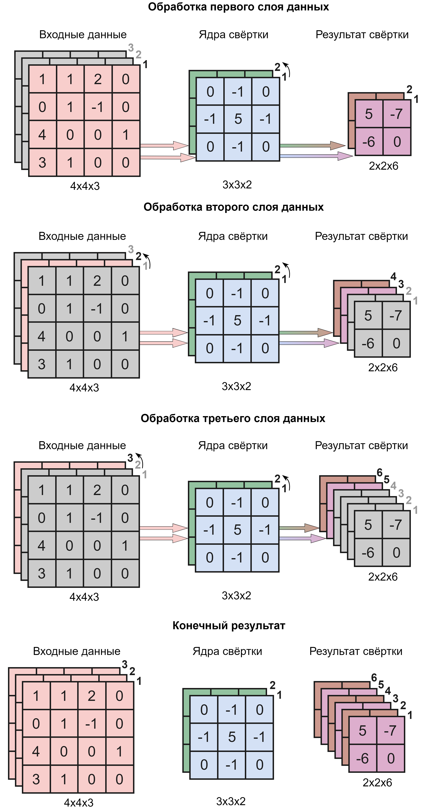
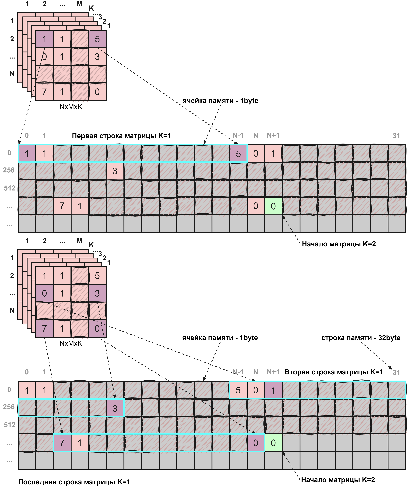
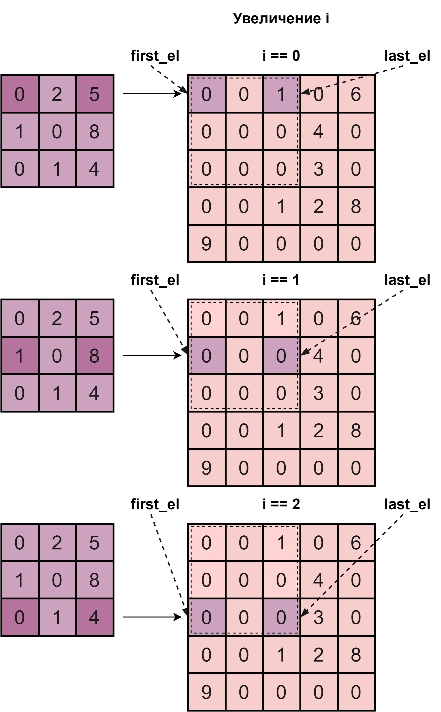
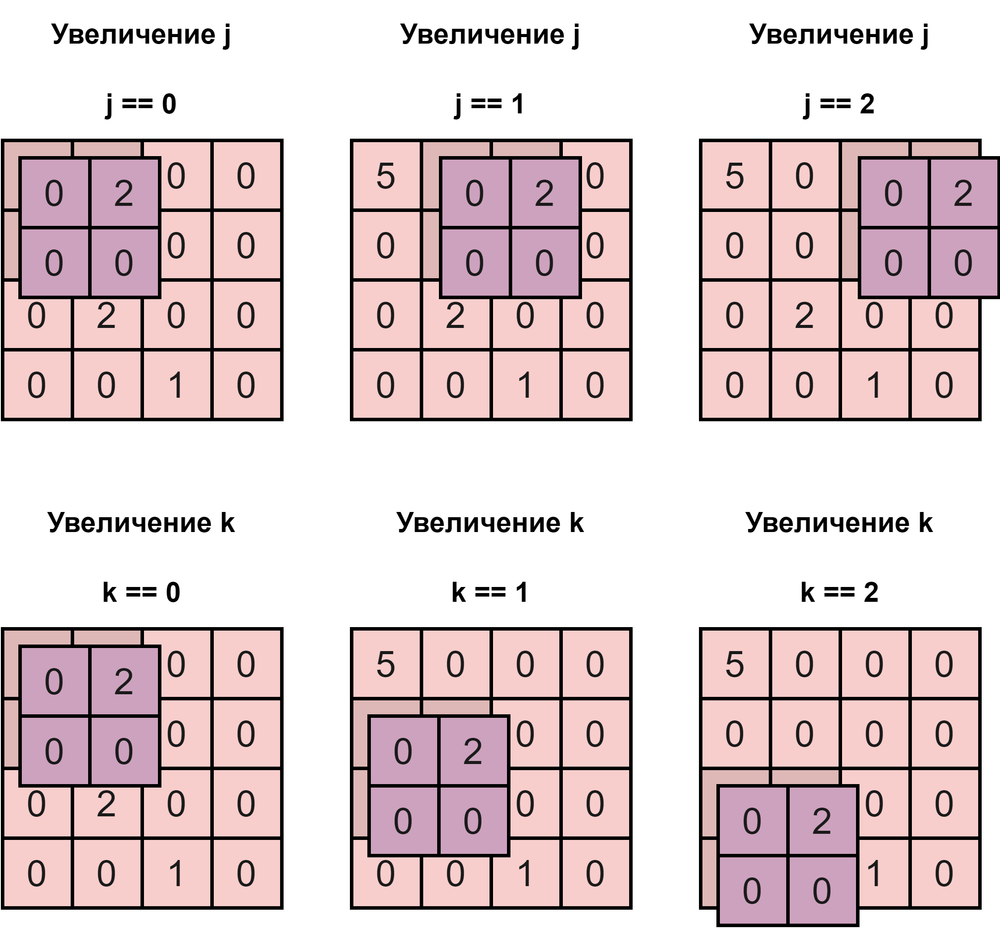

## Модуль управления NPU

  **Control unit** осуществляет управление работой LSU[2:0], а также управляется модулем MAC.

#### Список портов:

```verilog
  module npu_cu

  import npu_pkg::O_LEN;
  import npu_pkg::I_LEN;
  import npu_pkg::T_LEN;
  import npu_pkg::AXI_A_W;
  import npu_pkg::AXI_D_W;
  import npu_pkg::AXI_S_W;

(
  input  logic clk_i,
  input  logic arstn_i,

  // control
  output logic clear_o,

  // LSU interface
  ADDRDATA_BUS_SV.Master lsu_master [2:0],

  // CSR interface
  CSR_BUS_SV.Master csr_master,

  // MAC
  output logic                    t0_v_o, // t0 data valid input
  output logic signed [I_LEN-1:0] t0_o,   // t0 data input
  output logic                    t1_v_o, // t1 convloution core valid input
  output logic signed [I_LEN-1:0] t1_o,   // t1 convloution core input

  input  logic                    t2_v_i, // t2 valid convolution result
  input  logic signed [O_LEN-1:0] t2_i    // t2 convolution result
);

```


* Через сигнал **clear_o** CU управляет очисткой внутреннего регистра частичных сумм — sum_ff, который расположен в MAC.

---

* Посредством интерфейса [lsu_master](npu_addrdata_bus.md) [2:0] CU подключается к модулю [LSU](npu_lsu.md) (здесь CU выступает в роли **MASTER** устройства).

* Посредством интерфейса [csr_master](npu_csr_bus.md) CU подключается к модулю [CSR](npu_csr.md) (здесь CU выступает в роли **MASTER** устройства).

---

* t0_v_o — Валидность байта тензора данных, выставляемого CU на [MAC](npu_mac.md);
* t0_o — Байт тензора данных, выставляемый CU на [MAC](npu_mac.md);
* t1_v_o — Валидность байта ядра свёртки, выставляемого CU на [MAC](npu_mac.md);
* t1_o — Байт ядра свёртки, выставляемый CU на [MAC](npu_mac.md).

---

* t2_v_i — Валидность байта результата свёртки, выставляемого [MAC](npu_mac.md) на [CU](npu_cu.md);
* t2_i — Байт результата свёртки, выставляемый [MAC](npu_mac.md) на [CU](npu_cu.md).


### Управление вычислением свёртки:

#### Начнём с определения:

**Cвёртка** — это ключевая операция в свёрточных нейронных сетях. Она заключается в применении ядер свёртки к входным данным для выделения различных признаков.



Процесс свёртки происходит в несколько шагов:

1) **Ядро** свёртки **последовательно перемещается по тензору** данных (матрица входных данных).

2) Между данными из области, на которую накладывается ядро свёртки, и значениями этого ядра производится **знаковое поэлементное умножение**.

3) Затем значения полученных произведений **суммируются**. Таким образом, реультатом одной итерации примерения ядра свёртке к исходному тензору данных будет являться **одно число**.

4) Полученное число записывается в **новую матрицу**.

5) Процесс **повторяется для каждого возможного положения ядра свёртки** на тензоре данных.

6) Результатом будет являться **матрица**, меньшая или равная исходному тензору по геометрическим размерам (зависит от размерности ядра свёртки).

Ниже представлена иллюстрация, наглядно показывающая вычисление свёртки над двумерным тензором данных и двумерным ядром свертки.



#### Работа с 3-х мерными тензорами:

Теперь, когда мы разобрались, каким образом производится свёртка, если мы работаем с одним тензором данных и одним ядром свёртки, перейдём к разбору вычислений с многомерными тензорами и ядрами.

На рисунке ниже приведены 3-х мерные: тензор данных, ядро свёртки и их результат;



**Параметры матриц:**

Элемент матрицы представляет собой число в формате **int8 ∈ [-128:127]**;

**Тензор данных (T0):**
 * T0_0 Количество строк: 4;
 * T0_1 Количество столбцов: 4;
 * T0_2 Глубина: 3.

 **Ядро свёртки (T1):**
 * T1_0 Количество строк: 3;
 * T1_1 Количество столбцов: 3;
 * T1_2 Глубина: 2.

**Тензор результата (T2):**
 * T2_0 Количество строк: 2;
 * T2_1 Количество столбцов: 2;
 * T2_2 Глубина: 6.

Размерность тензора результата однозначно определяется размерностями тензора данных и ядра свёртки по следующим формулам:

 * Количество строк: T2_0 = T0_0 – T1_0 + 1;
 * Количество столбцов: T2_1 = T0_1 – T1_1 + 1;
 * Глубина: T2_2 = T0_2 x T1_2.

Подробнее про параметры тензоров можно прочитать в [CSR](npu_csr.md);

**Алгоритм выполнения 3-х мерной свёртки:**

1) Выбирается **первый тензор** данных и **первое ядро** свёртки.

1) **Ядро свёртки последовательно перемещается по тензору** данных (матрица входных данных).

2) Между данными из области, на которую накладывается ядро свёртки, и значениями этого ядра производится **знаковое поэлементное умножение**.

3) Затем значения полученных произведений **суммируются**. Таким образом, реультатом одной итерации примерения ядра свёртке к исходному тензору данных будет являться одно число.

4) Полученное число записывается в **новую матрицу**.

5) Процесс **повторяется для каждого возможного положения ядра свёртки** на тензоре данных.

6) Затем **ядро свёртки меняется на следующее** (с большей глубиной), и процесс для выбранного тензора данных **повторяется**.

7) После того, как для соответствующего тензора данных были использованы все имеющиеся ядра свёртки, производится **замена тензора данных на более глубокий**, после чего новый тензор данных последовательно перемножается со всеми ядрами свёртки, как было описано ранее.

На иллюстрации ниже приведён **пример** последовательного вычисления свёрток над **трёхмерными** тензорами:



#### Как тензоры расположены в памяти:

На рисунке ниже представлена схема расположения тензоров в памяти.



Как можно увидеть, тензоры располагаются в память построчно, начиная с первой и до N-й. За первой матрицей идёт вторая и так до К-й матрицы.

#### Адресация в 3-х мерных тензорах:

Для того чтобы выполнить свёртку, нам необходимо в правильном порядке вычитывать из памяти элементы тензоров.

В CU реализованы 5 счётчиков, при помощи которых реализуется адресация.

На рисунке ниже представлена **зависимость смещения строки тензора данных** (из которой мы поэлементно будем считывать данные) **от значения i**:



На рисунке ниже представлена **зависимость смещения ядра свёртки** относительно тензора данных **в зависимости от значения j и k**:



 * **iter_i** — отвечает за построчное смещение в рамках одной операции свёртки. Увеличение i приводит к переходу на следующую строку.

 * **iter_j** — отвечает за смещение ядра свёртки вправо по тензору данных. Увеличение j на единицу приводит к сдвигу вправо на единицу ядра свёртки относительно тензора данных.

 * **iter_k** — отвечает за смещение ядра свёртки вниз по тензору данных. Увеличение k на единицу приводит к свдигу ядра свёртки на единицу вниз относительно тензора данных.

 * **iter_n** — отвечает за перемещение между ядрами свёртки, увеличение n на единицу приведёт к переходу к более глубокому ядру свёртки.

 * **iter_m** — отвечает за перемещение между тензорами данных, увеличение m на единицу приведёт к переходу к более глубокому тензору данных.

 Значения данных счётчиков используются для вычисления первого и последнего элемента строки тензора данных, на которые будет накладываться строка ядра свёртки.

```Verilog
  assign first_el = ( csr_master.csr_addr_t0 + iter_j * 8 ) + ( csr_master.csr_addr_t0_0 * csr_master.csr_addr_t0_1 * iter_m * 8 ) + ( csr_master.csr_addr_t0_1 * ( iter_i + iter_k ) * 8 );
  assign last_el  = ( csr_master.csr_addr_t0 + iter_j * 8 ) + ( csr_master.csr_addr_t0_0 * csr_master.csr_addr_t0_1 * iter_m * 8 ) + ( csr_master.csr_addr_t0_1 * ( iter_i + iter_k ) * 8 ) + ( ( csr_master.csr_addr_t1_1 - 1 ) * 8 );
```

 * first_el — адрес первого элемента строки;
 * last_el  — адрес последнего элемента строки.


На основе значений счётчиков (i,j,k,n,m) и адресов first_el и last_el формируются адреса для чтения и записи в память через LSU:

Адрес для чтения тензора данных:
```Verilog
  always_ff @( posedge clk_i ) begin
    if( ~arstn_i ) begin
      addr_t0_ff <= '0;
    end
    else begin
      if ( npu_state == NPU_IDLE ) begin
        addr_t0_ff <= csr_master.csr_addr_t0;
      end
      else if ( ( iter_i_stall_ff && ~iter_j_en ) || ( iter_j_stall_ff && ~iter_k_en ) || iter_k_stall_ff ) begin
        addr_t0_ff <= first_el;
      end
      else if ( npu_state == NPU_CALC ) begin
        if ( lsu_0_rd_hs && lsu_1_rd_hs && ( ~iter_j_en && ~iter_k_en && ~iter_n_en && ~iter_m_en ) ) begin
          if ( addr_t0_ff < last_el_ff ) begin
            addr_t0_ff <= addr_t0_ff + 'd8;
          end
        end
      end
    end
  end
```

Данный адрес увеличивается в диапазоне от first_el до last_el, за счёт чего мы вычитываем по одному элементу тензора данных за раз.

---

Адрес для чтения ядра свёртки:
```Verilog
  always_ff @( posedge clk_i ) begin
    if( ~arstn_i ) begin
      addr_t1_ff <= '0;
    end
    else begin
      if ( npu_state == NPU_IDLE ) begin
        addr_t1_ff <= csr_master.csr_addr_t1;
      end
      else if ( iter_j_stall_ff || iter_k_stall_ff ) begin
        addr_t1_ff <= csr_master.csr_addr_t1 + ( csr_master.csr_addr_t1_0 * csr_master.csr_addr_t1_1 * iter_n * 8 );
      end
      else if ( npu_state == NPU_CALC ) begin
        if ( lsu_0_rd_hs && lsu_1_rd_hs && ( ~iter_j_en && ~iter_k_en && ~iter_n_en && ~iter_m_en ) ) begin
          if ( ~iter_j_en && ~iter_k_en && ~iter_n_en && ~iter_m_en ) begin
            addr_t1_ff <= addr_t1_ff + 'd8;
          end
        end
      end
    end
  end
```

Данный адрес увеличивается в диапазоне от первого до последнего элемента ядра свёртки, за счёт чего мы вычитываем по одному элементу тензора данных за раз. Увеличение n приводит к переходу к следующему ядру свёртки.

---

Адрес для записи в память:
```Verilog
  always_ff @( posedge clk_i ) begin
    if( ~arstn_i ) begin
      addr_t2_ff <= '0;
    end
    else begin
      if ( npu_state == NPU_IDLE ) begin
        addr_t2_ff <= csr_master.csr_addr_t2;
      end
      else if ( npu_state == NPU_CALC ) begin
        if ( lsu_2_wd_hs ) begin
          if ( iter_j_en || iter_k_en || iter_n_en || iter_m_en ) begin
            addr_t2_ff <= addr_t2_ff + 'd8;
          end
        end
      end
    end
  end
```
Данный адрес увеличивается в диапазоне от первого до последнего элемента матрицы результата, за счёт чего мы записываем в память по одному элементу тензора результата за раз. Увеличение j / k / n / m приводит к увеличению адреса, так-как это означает единичный свдиг ядра свёртки относительно тензора данных, что эквивалентно получению единичного элемента матрицы результата.

---
---