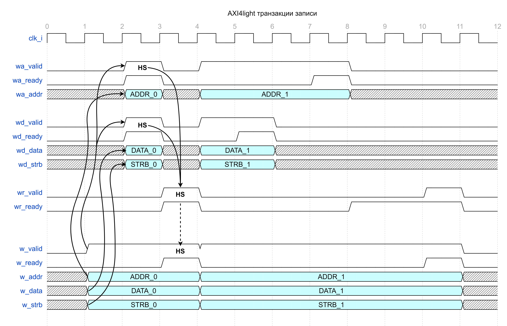
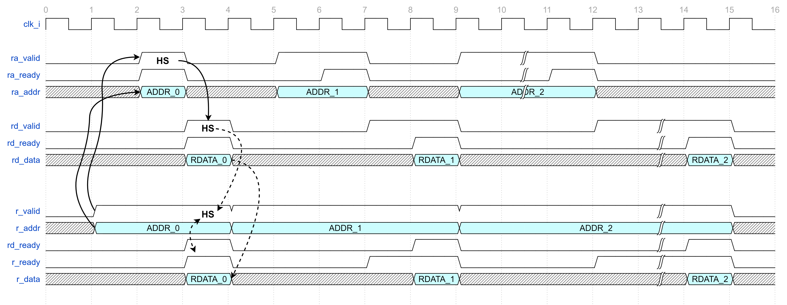

## Модуль LSU

#### Список портов:

```verilog
module npu_lsu (
  input  logic clk_i,
  input  logic arstn_i,

  ADDRDATA_BUS_SV.Slave  slave,

  AXI4LITE_BUS_SV.Master master
);
```

 ADDRDATA_BUS_SV.Slave [slave](doc/npu_addrdata_bus.md) — ***AD шина из MAC***

 AXI4LITE_BUS_SV.Master [master](doc/npu_axi4litе_bus.md) — ***AXI4-Lite шина в память***

---

#### Пример транзакция записи:

Примечание: *HS — handshake (рукопожатие);*



На первом этапе данные от MAC устанавливаются на входах шины AD:

 * w_valid — ***Валидность выставляемого MAC адреса***;
 * w_addr  — ***Адрес для записи***;
 * w_data  — ***Данные для записи***;
 * w_strb  — ***Байтовая валидность данных***.

На следующий такт FSM LSU переходит в состояние WRITE и выставляет на AXI4-Lite следующие данные:

Канал записи адреса WA:

 * wa_valid — ***Валидность выставляемого адреса***;
 * wa_addr  — ***Адрес для записи***.

Канал записи данных WD:

 * wd_valid — ***Валидность выставляемых данных***;
 * wd_data  — ***Данные для записи***;
 * wd_strb  — ***Байтовая валидность данных***.

Далее ожидается возникновение handshake:

 * HS на канале WA ( wa_valid && wa_ready );
 * HS на канале WD ( wd_valid && wd_ready ).

Логическое произведение master.wr_ready && master.wr_valid через w_ready передаётся на MAC. Это является HS шины AD. После его возникновения MAC может выставлять новые данные на шину AD.

В то же время в LSU ожидается окончательное подтверждение транзакции записи по AXI4-Lite, его обозначает HS_WR между сигналами wr_valid && wr_ready.

 * wr_ready выставляется в LSU при возникновени HS_WA && HS_WD;
 * wr_valid мы ожидаем от памяти в качестве подтверждения.

---

#### Пример транзакция чтения:


Примечание: *HS - handshake (рукопожатие);*



На первом этапе данные от MAC устанавливаются на входах шины AD:

 * r_valid — ***Валидность выставляемого MAC адреса***;
 * r_addr  — ***Адрес для чтения***.

На следующий такт FSM LSU переходит в состояние READ и выставляет на AXI4-Lite следующие данные:

Канал чтения адреса RA:

 * ra_valid — ***Валидность выставляемого адреса***;
 * ra_addr  — ***Адрес для чтения***.

Далее ожидается поднятие ra_ready со стороны пямяти (ra_valid && ra_ready -> HS_RA).

После возникновения HS_RA выставляется rd_ready (rd_valid && rd_ready -> HS_RD).

 * AD rd_ready  — ***Готовность MAC считать данные***;
 * AXI rd_ready — ***Готовность MAC считать данные***.

Данные полученные из памяти в момент HS_RD выставляются на выходы шины AD:

 * r_ready   — ***Готовность LSU  к выдаче валидных данных***;
 * r_data    — ***Считанные данные***.

 На шине AD просиходит HS_AD (r_valid && r_ready -> HS_AD).

---
---

#### Граф конечного автомата LSU:
