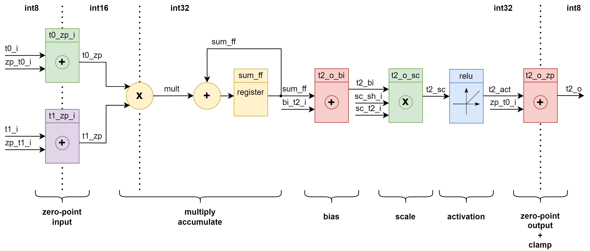

## Модуль умножения с накоплением MAC

#### Список вложенных модулей:

>[npu_zp_i](npu_zp_i.md)
>
>[npu_bias_o](npu_bias_o.md)
>
>[npu_scale_o](npu_scale_o.md)
>
>[npu_relu](npu_relu.md)
>
>[npu_zp_o](npu_zp_o.md)

---

#### Список портов:

```verilog
module npu_mac
  import npu_pkg::*;
(
  input  logic                    clk_i,
  input  logic                    arstn_i,

  input  logic                    clear_i,

  // for input data (t0,t1):
  input  logic signed [I_LEN-1:0] zp_t0_i, // t0 zeropoint input
  input  logic signed [I_LEN-1:0] zp_t1_i, // t1 zeropoint input

  input  logic                    t0_v_i,  // t0 data valid input
  input  logic signed [I_LEN-1:0] t0_i,    // t0 data input
  input  logic                    t1_v_i,  // t1 convloution core valid input
  input  logic signed [I_LEN-1:0] t1_i,    // t1 convloution core input

  // for output data (t2):
  input  logic signed [I_LEN-1:0] zp_t2_i, // t2 zeropoint input

  input  logic signed [M_LEN-1:0] bi_t2_i, // t2 bias input

  input  logic signed [M_LEN-1:0] sc_t2_i, // t2 scale input
  input  logic        [T_LEN-7:0] sc_sh_i, // t2 shift

  output logic                    t2_v_o,  // t2 valid convolution result
  output logic signed [O_LEN-1:0] t2_o     // t2 convolution result
);

```

* clear —  управляет очисткой внутреннего регистра частичных сумм - sum_ff.

---

* csr_zp_t0 — Zero-point для тензора данных (8-bit $signed);
* csr_zp_t1 — Zero-point для ядра свёртки (8-bit $signed);
* csr_zp_t2 — Zero-point для результата свёртки (8-bit $signed);
* csr_bias_t2 — Bias для результата свёртки (32-bit $signed);
* csr_scale_t2 — Scale для результата свёртки (32-bit $signed);
* csr_shift_t2 — Shift для результата свёртки (5-bit unsigned).

---

* t0_valid — Валидность байта тензора данных;
* t0_data — Байт тензора данных;
* t1_valid — Валидность байта ядра свёртки;
* t1_data — Байт ядра свёртки.

---

* t2_valid - Валидность байта результата свёртки;
* t2_data - Байт результата свёртки.

---

#### Схема алгоритма работы MAC:



---

#### Алгоритм работы MAC:

1) На вход модуля приходят два числа **t0_data** и **t1_data** (int8). Каждое из них необходимо **знаково** сложить с соответствующим его тензору zero point — **zp_t0_i** и **zp_t1_i**. В результате сложения мы получим два числа **t0_zp** и **t1_zp** (int16):


 * **t0_zp** (int16) = **t0_data** (int8) + **zp_t0_i** (int8);

Инстанс модуля [t0_i_zp](npu_zp_i.md):
```Verilog
  // zero point for t0 data input:
  npu_zp_i t0_i_zp (
    .zp_i    ( zp_t0_i ),

    .data_i  ( t0_i    ),
    .data_o  ( t0_zp   ),

    .valid_i ( t0_v_i  ),
    .valid_o ( t0_v_zp )
  );
```

 * **t1_zp** (int16) = **t1_data** (int8) + **zp_t1_i** (int8);

Инстанс модуля [t1_i_zp](npu_zp_i.md):
```Verilog
  // zero point for t1 convloution core input:
  npu_zp_i t1_i_zp (
    .zp_i    ( zp_t1_i ),

    .data_i  ( t1_i    ),
    .data_o  ( t1_zp   ),

    .valid_i ( t1_v_i  ),
    .valid_o ( t1_v_zp )
  );
```

2) Два полученных значения необходимо **знаково** перемножить, в результате чего мы получим **mult** (int32):

  * **mult** (int32) = **t0_zp** (int16) x **t1_zp** (int16);

```Verilog
  assign mult   = $signed(t0_zp) * $signed(t1_zp);
  assign mult_v = t0_v_zp && t1_v_zp;
```

3) Полученное произведение необходимо **знаково** сложить с частичными суммами, которые хранятся в регистре sum_ff (int32):

 * sum_ovf (int32) = sum_ff (int32) + mult (int32);

Очевидно, что результат в процессе сложения может переполниться, поэтому нам необходимо проверять условие переполнения и в случае положительного/отрицательного переполнения обозначать результат как максимальное/минимальное значение int32:

```Verilog
  // adder overflow control:
  assign ovf_p_l = ~sum_ff[M_LEN-1] & ~mult[M_LEN-1] &  sum_ovf[M_LEN-1];
  assign ovf_n_l =  sum_ff[M_LEN-1] &  mult[M_LEN-1] & ~sum_ovf[M_LEN-1];

  // checking for adder overflow:
  assign sum = ovf_p_l ? $signed({1'b0,{(M_LEN-1){1'b1}}}) : // if adder is positive overflowed, the entire result[M_LEN-1:0] is filled with largest positive number
               ovf_n_l ? $signed({1'b1,{(M_LEN-1){1'b0}}}) : // if adder is negative overflowed, the entire result[M_LEN-1:0] is filled with largest negative number
                         $signed(sum_ovf);
```

Полученное после проверки переполнения значение sum (int32) записывается в регистр sum_ff (int32).

**Примечание:**
 * Процесс накопления частичной суммы в регистре sum_ff (int32) будет продолжаться, пока подаются валидные данные.
 * Регистр sum_ff (int32) имеет возможность сброcа по сигналу clear_i.

 ```Verilog
  always_ff @( posedge clk_i ) begin
    if ( ~arstn_i || clear_i ) begin
      sum_ff <= '0;
    end
    else begin
      if ( sum_v ) begin
        sum_ff <= sum;
      end
    end
  end
```

4) Для получения конечного результата значение sum_ff (int32) необходимо **знаково** сложить с **bi_t2_i** (int32):

  * **t2_bi** (int32) = **sum_ff** (int32) x **bi_t2_i** (int32);

Инстанс модуля [t2_o_bi](npu_bias_o.md):
```Verilog
  // bias for t2 data output:
  npu_bi_o t2_o_bi (
    .bias_i  ( bi_t2_i ),

    .data_i  ( sum_ff  ),
    .data_o  ( t2_bi   ),

    .valid_i ( sum_v_ff),
    .valid_o ( t2_v_bi )
  );
```

5) Далее значение **t2_bi** (int32) необходимо **знаково** умножить на **sc_t2_i** (int32) и сдвинуть на 31, а также на **sc_sh_i** (5-bit unsigned):

  * **t2_bi** (int32) = **sum_ff** (int32) x **bi_t2_i** (int32) >>> 'd31 >>> **sc_sh_i**;

Инстанс модуля [t2_o_sc](npu_scale_o.md):
```Verilog
  // scale for t2 data output:
  npu_sc_o t2_o_sc (
    .shift_i ( sc_sh_i ),
    .scale_i ( sc_t2_i ),

    .data_i  ( t2_bi   ),
    .data_o  ( t2_sc   ),

    .valid_i ( t2_v_bi ),
    .valid_o ( t2_v_sc )
  );
```

6) Далее значение **t2_sc** (int32) необходимо пропустить через функцию активации ReLU:

  * **t2_act** (int32) = ( **t2_sc** > 0 ) ? **t2_sc** (int32) : **'0**;

Инстанс модуля [relu](npu_relu.md):
```Verilog
  // scale for t2 data output:
  npu_relu relu (
    .data_i  ( t2_sc    ),
    .data_o  ( t2_act   ),

    .valid_i ( t2_v_sc  ),
    .valid_o ( t2_v_act )
  );
```

В результате на выходе мы получим значение **t2_act** (int32), которое больше или равно нулю;

7) Финальным этапом является сложение **t2_act** (int32) с zero point для результата свёртки **zp_t2_i** (int8). В результате сложения мы получим число **t2_zp** (int8), так как дополнительно приведём результат сложения к диапазону int8:

 * **t2_zp** (int8) = **t2_act** (int32) + **zp_t2_i** (int8);

Инстанс модуля [t2_o_zp](npu_zp_o.md):
```Verilog
  // zeropoint for t2 data output:
  npu_zp_o t2_o_zp (
    .zp_i    ( zp_t2_i  ),

    .data_i  ( t2_act   ),
    .data_o  ( t2_zp    ),

    .valid_i ( t2_v_act ),
    .valid_o ( t2_v_zp  )
  );
```

---
---