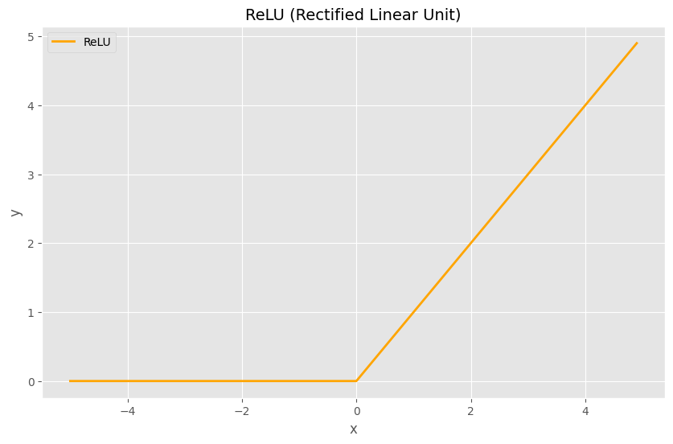

## Модуль функции активации ReLU

Функция активации в нейронных сетях нужна для того, чтобы внести нелинейность в выходной сигнал модели.

ReLU широко используется в свёрточных (CNN) и полносвязных глубоких сетях, использующихся для задач компьютерного зрения (распознавание изображений), обработки естественного языка (NLP) и других сложных задач машинного обучения.

---

#### График функции активации:



---

#### Формула:

$f(x) = 0; x ∈ (-∞;0)$  

$f(x) = x; x ∈ [0;+∞)$

---

#### Реализация:

```verilog
module npu_relu
  import npu_pkg::M_LEN;
(
  input  logic signed [M_LEN-1:0] data_i,
  output logic signed [M_LEN-1:0] data_o,

  input  logic                    valid_i,
  output logic                    valid_o
);

  assign valid_o = valid_i;

  assign data_o = ( $signed(data_i) > 0 ) ? data_i : '0;

endmodule
```

---

#### Сигналы:

* data_i — ***Входные данные***
* data_o — ***Выходные данные***

---

* valid_i — ***Валидность входных данных***
* valid_o — ***Валидность выходных данных***

---
---