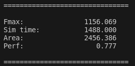

# Ускоритель операций свертки для NPU

**Ускоритель операций светки** — это аппаратный блок, призванный производить вычисления сверток над **трехмерными** трензорами из памяти и запись полученного результата обратно в память.
**Управление** блоком осуществляется через **CSR-регистры**, доступные для записи/чтения по интерфейсу **APB**.
Для чтения и записи тензоров из адресного пространства доступно три интерфейса **AXI4-Lite**.

Проект написан для хакатона **SoC Design Challenge** 2025 года для трека **Basic+**.
Референсный дизайн ускорителя спроектирован в упрощенном варианте с итерационным вычислением **одной свертки в один момент времени**.


## Основные характеристики
- Использует **целочисленную арифметику** и хранение тензоров в **формате int8** в памяти.
- Интерфейс **APB** для **конфигурации CSR** регистров.
- Три интерфейса **AXI4-Lite** для чтения/записи данных из памяти.
- Разрядность данных в **AXI4-Lite 256 бит**.
- Референсный дизайн ускорителя в упрощенном варианте с итерационным вычислением **одной свертки в один момент времени**.
- Настроенное окружение под функциональную верификацию.
- Написан на **SystemVerilog** с использованием интерфейсов. Об интерфейсах можно [прочитать тут](./doc/interfaces.md#interface).

## Содержимое репозитория
|Директория             |Описание                                                             |
|-----------------------|---------------------------------------------------------------------|
|doc                    |Документация на проект                                               |
|list                   |Списки исходников для синтеза и симуляции                            |
|rtl                    |Исходные коды ядра интерконнекта                                     |
|sdc                    |Констрейны для синтеза                                               |
|dv                     |Верификационное окружение                                            |
|syn                    |Скрипты для синтеза                                                  |

## Задание

В задании вам необходимо **оптимизировать микроархитектуру предложенного ускорителя** по критериям **максимальной производительности, площади**. Формулы расчета и учета результатов участников описаны в [правилах](./doc/RTL_rules.md).

Предлагаемый ускоритель производит вычисления над **трехмерными тензорами**. Референсный тест состоит из последовательности операций над тензором разных конфигураций. Диапазоны размерностей тензоров указаны в описании CSR регистров.

Обратите внимание на **весовые коэффициенты** при расчете итогового балла в правилах соревнования. Они отражают важность критериев с точки зрения итоговой оценки и являются субъективным отражением видения организаторов на то, каким должен быть финальный результат.

## Общая структура NPU:

Рефересный дизайн состоит из 3 основных частей:
* [Конфигурационные регистры](doc/npu_csr.md), доступные по интерфейсу [APB](doc/npu_apb_bus.md).
* [Вычислительный модуль](doc/npu_mac_top.md), состоящий из управляющего модуля [CU](doc/npu_cu.md) и модуля умножения с накоплением [MAC](doc/npu_mac.md).
* [LSU](doc/npu_lsu.md) модули для чтения/записи данных через [AXI4-Lite](doc/npu_axi4litе_bus.md.md).

### Список модулей в составе NPU:

> **Структура референсного дизайна:**
>
> [npu_top](doc/npu_top.md)
>>
>> [npu_mac_top](doc/npu_mac_top.md)
>>>
>>>[npu_cu](doc/npu_cu.md)
>>>
>>>[npu_mac](doc/npu_mac.md)
>>>>
>>>>[npu_zp_i](doc/npu_zp_i.md)
>>>>
>>>>[npu_bias_o](doc/npu_bias_o.md)
>>>>
>>>>[npu_scale_o](doc/npu_scale_o.md)
>>>>
>>>>[npu_relu](doc/npu_relu.md)
>>>>
>>>>[npu_zp_o](doc/npu_zp_o.md)
>>
>> [npu_csr](doc/npu_csr.md)
>>
>> [npu_lsu](doc/npu_lsu.md)
>
> **Параметры:**
>
> [npu_pkg](doc/npu_pkg.md)
>
> **Интерфейсы:**
>
> [npu_addrdata_bus](doc/npu_addrdata_bus.md)
>
> [npu_apb_bus](doc/npu_apb_bus.md)
>
> [npu_axi4lite_bus](doc/npu_axi4litе_bus.md)
>
> [npu_csr_bus](doc/npu_csr_bus.md)


### Конфигурационные регистры CSR

Состоят из регистров для управления работой ускорителя и мониторинга его статуса

Адрес | Название       | MAC access | APB access | Размер | Диапазон значений        | Описание                                                               |
----- | -------------- | ---------- | ---------- | ------ | ------------------------ | ---------------------------------------------------------------------- |
0x0   | CSR_STATUS     | WO         | RO         |  1-bit | [0:1]                    | Хранит состояние модуля. 1 – идет вычисление. 0 – состояние ожидания     |
0x4   | CSR_CONTROL    | RO         | WO         |  1-bit | [0:1]                    | Запись 1 в регистр, пока MAC в состоянии ожидания, запускает вычисление |
| <div></div>                                                                                                                                                 |
0x8   | CSR_ADDR_T0    | RO         | RW         | 32-bit | [0:4294967295]           | Хранит адрес для чтения тензора 0 в ОЗУ                                |
0xC   | CSR_ADDR_T1    | RO         | RW         | 32-bit | [0:4294967295]           | Хранит адрес для чтения тензора 1 в ОЗУ                                |
0x10  | CSR_ADDR_T2    | RO         | RW         | 32-bit | [0:4294967295]           | Хранит адрес для чтения тензора 2 в ОЗУ                                |
| <div></div>                                                                                                                                                 |
0x14  | CSR_ADDR_T0_0  | RO         | RW         | 10-bit | [8:512]                  | Хранит количество строк тензора 0                                      |
0x18  | CSR_ADDR_T0_1  | RO         | RW         | 10-bit | [8:512]                  | Хранит количество столбцов тензора 0                                   |
0x1С  | CSR_ADDR_T0_2  | RO         | RW         |  6-bit | [4:32]                   | Хранит глубину тензора 0                                               |
0x20  | CSR_ADDR_T1_0  | RO         | RW         |  5-bit | [3:16]                   | Хранит количество строк тензора 1                                      |
0x24  | CSR_ADDR_T1_1  | RO         | RW         |  5-bit | [3:16]                   | Хранит количество столбцов тензора 1                                   |
0x28  | CSR_ADDR_T1_2  | RO         | RW         |  6-bit | [3:32]                   | Хранит глубину тензора 1                                               |
0x2С  | CSR_ADDR_T2_0  | RO         | RW         | 10-bit | [8:512]                  | Хранит количество строк тензора 2                                      |
0x30  | CSR_ADDR_T2_1  | RO         | RW         | 10-bit | [8:512]                  | Хранит количество столбцов тензора 2                                   |
0x34  | CSR_ADDR_T2_2  | RO         | RW         | 11-bit | [12:1024]                | Хранит глубину тензора 2 (произведение глубины тензоров 0 и 1 )        |
| <div></div>                                                                                                                                                 |
0x38  | CSR_ZP_T0      | RO         | RW         |  8-bit | [-128:127]               | Хранит **$signed** параметр ZERO_POINT  тензора 0                      |
0x3С  | CSR_ZP_T1      | RO         | RW         |  8-bit | [-128:127]               | Хранит **$signed** параметр ZERO_POINT  тензора 1                      |
0x40  | CSR_ZP_T2      | RO         | RW         |  8-bit | [-128:127]               | Хранит **$signed** параметр ZERO_POINT  тензора 2                      |
| <div></div>                                                                                                                                                 |
0x44  | CSR_BIAS_T2    | RO         | RW         | 32-bit | [-2147483648:2147483647] | Хранит **$signed** параметр BIAS  тензора 2                            |
0x48  | CSR_SCALE_T2   | RO         | RW         | 32-bit | [1073741824:2147483647]  | Хранит **$signed** параметр SCALE тензора 2                            |
0x4С  | CSR_SHIFT_T2   | RO         | RW         |  5-bit | [0:31]                   | Хранит параметр SHIFT тензора 2                                        |

**Примечание**: стоит обратить внимание, что размерности матрицы **не могуть быть нулевыми**;

Дополнительные сведения:

 * Модуль [npu_csr](doc/npu_csr.md).
 * Интерфейс [npu_csr_bus](doc/npu_csr_bus.md).
 * Интерфейс [npu_apb_bus](doc/npu_apb_bus.md).

#### Вычислительный модуль

Вычислительный модуль в референсной реализации состоит из единственного модуля умножения с накоплением [MAC](doc/npu_mac_top.md), функции активации [ReLU](doc/npu_relu.md) и управляющего модуля [CU](doc/npu_cu.md). Модуль реализует операцию свертки для матриц. Размерность ядра свертки берется из размерностей тензора 1 - CSR_ADDR_T1_0, CSR_ADDR_T1_1.

Свертка производится над данными с шагом 1.

**Управляющий модуль** [CU](doc/npu_cu.md):
* Управляет операциями чтения/записи (распаковывает и упаковывает данные из тензоров) [MAC](doc/npu_mac_top.md) в память посредством [LSU](doc/npu_lsu.md).
* Управляет процессом вычисления в модуле умножения с накоплением [npu_mac](doc/npu_mac.md).
* Управляет взаимодействием [MAC](doc/npu_mac_top.md) с [CSR](doc/npu_csr.md) (чтение/запись параметров).

Формат данных для вычисления — INT8.

**Схема работы с данными в формате INT8**


#### LSU
Три модуля [LSU](doc/npu_lsu.md) отвечают за чтение и запись данных по интерфейсу [AXI4-Lite](doc/npu_axi4litе_bus.md). **LSU0, LSU1 — чтение, LSU2 — запись.**
Со стороны вычислительного модуля LSU имеют простой [интерфейс адрес-данные](doc/npu_addrdata_bus.md).
Разрядность адреса **32 бита**.
Разрядность данных **256 бит**.

#### Структура теста и верификационного окружения
Тест состоит из N вызываемых операций над тензорами. Между операциями меняется размерность входных и выходных тензоров. Тест завершается, когда результат последней операции полностью записан в ОЗУ и модуль перешел в состояние ожидания.
Верификационное окружение построено на основе **VIP APB и AXI4-Lite**:
* Имитирует адресное пространство.
* Генерирует транзакции по APB.
* Генерирует тензоры данных и их конфигурации согласно ограничениям.
* Проверяет корректность вычислений программной модели.


### Маршрут

Рекомендуемый маршрут оптимизации:

1. Проанализировать микроархитектуру референсного дизайна. Ознакомиться со спецификацией.
2. Разработка микроархитектуры для оптимизации дизайна.
3. Оптимизация дизайна — написание RTL. Необходимо ознакомиться с [системой сборки](doc/genus/build_sys.adoc), если требуется добавить новые файлы. Также необходимо ознакомиться с [компиляцией памятей](doc/genus/mem.adoc) — это поможет в оптимизации.
4. Отладка RTL, итеративные правки:
  * Симуляция RTL в готовом верификационном окружении. Цель — подтверждение работоспособности дизайна. Ознакомься с [инструкцией по запуску тестов для RTL]().
  * Логический синтез в genus. Цель — подтверждение синтезируемости дизайна, оценка частоты и площади. Ознакомься с [инструкцией](doc/genus/genus.adoc) по логическому синтезу и [мануалу](doc/genus/genus_sta.adoc) по STA анализу.
  * Симуляция netlist в готовом верификационном окружении. Цель — подтверждение соответствия между RTL и netlist, подтверждение работоспособности.
5. Оценка результатов. Для этого необходимо запустить скрипт командой:

```
make metrics
```
Вывод будет примерно такой:



#### Полезные файлы
- [Правила проведения и оценки RTL-трека](doc/RTL_rules.md)
<br>

- [Система сборки RTL](doc/genus/build_sys.adoc)
- [Инструкция по проведению логического синтеза в genus](doc/genus/genus.adoc)
- [Руководство по работе с STA в Genus](doc/genus/genus_sta.adoc)
- [Hard Macro памяти](doc/genus/mem.adoc)
<br>

- [Инструкция по запуску верификационного окружения](doc/Questa_How_To.md)
- [Инструкция по запуску CI](doc/CI.md)
- [Руководство по работе с GitLab](doc/git_manual.md)
